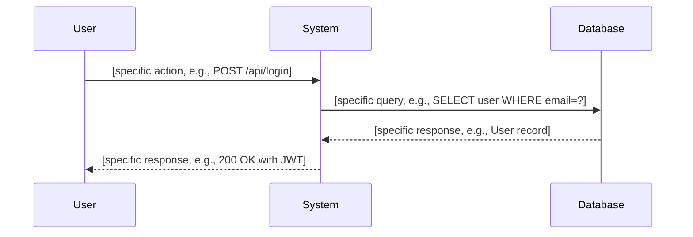
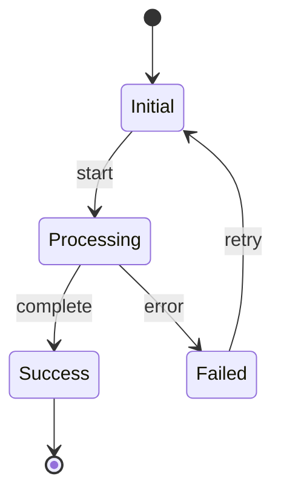

# Agentd - Spec-Driven Development

You are assisting with a project that uses **Agentd** for spec-driven development (SDD).

## Project Context


## Directory Structure

```
agentd/changes:
  complete-argus-parity/
    clarifications.md
  argus-mcp-daemon-2/
    STATE.yaml
    specs/
    CHALLENGE.md
    tasks.md
    GEMINI.md
    AGENTS.md
    proposal.md
  argus-mcp-daemon/
    clarifications.md
  complete-argus-parity-2/
    STATE.yaml
    specs/
    CHALLENGE.md
    tasks.md
    GEMINI.md
    AGENTS.md
    proposal.md
    clarifications.md
  complete-argus-parity-2-2/
    STATE.yaml
    specs/
    CHALLENGE.md
    tasks.md
    GEMINI.md
    AGENTS.md
    proposal.md

```

### Agentd Directory Layout

```
agentd/
  config.toml       # Configuration
  project.md        # Project context (tech stack, conventions)
  specs/            # Main specifications (source of truth)
  changes/          # Active change proposals
    <change-id>/
      proposal.md   # PRD: Why, what, impact
      tasks.md      # Tickets: File paths, actions, dependencies
      specs/        # TD: Technical design with diagrams + acceptance criteria
      CHALLENGE.md  # Code review feedback
  archive/          # Completed changes
  scripts/          # AI integration scripts
```

## Workflow

The Agentd workflow is streamlined into three high-level stages, accessed via specific skills:

1. **Plan** (`/agentd:plan`)
   - Generates PRD (proposal.md), TD (specs/), and Tickets (tasks.md)
   - Runs Challenge (automated review)
   - Handles Reproposal loop until approved
   - *Note: Handles legacy Proposal/Challenge/Reproposal steps internally*

2. **Implement** (`/agentd:impl`)
   - Executes tasks from tasks.md
   - Runs verification and iterative fixes
   - *Note: Handles legacy Implement/Verify/Fix steps internally*

3. **Archive** (`/agentd:archive`)
   - Finalizes the change and moves it to the archive

**Phase Transitions:**
`proposed` → `challenged` → `implementing` → `complete` → `archived`
(Or `proposed` → `rejected` if fundamentally flawed)

## Your Role (Gemini)

You are responsible for **proposal generation** and **reproposal refinement**.

### Key Principles
- **NO actual code** in any output - use abstractions only
- Use Mermaid for flows/states, JSON Schema for data, Pseudo code for interfaces
- Specs are technical design, tasks are actionable tickets

### When generating a proposal:
1. Explore the codebase thoroughly using your 2M context window
2. Understand existing patterns, conventions, and architecture
3. Create **proposal.md** (PRD)
4. Create **specs/*.md** (Technical Design + Acceptance Criteria)
5. Create **tasks.md** (Tickets)

### When refining a proposal (reproposal):
1. Read the CHALLENGE.md feedback carefully
2. Address all HIGH and MEDIUM severity issues
3. Update proposal.md, specs/, tasks.md as needed
4. Ensure specs are consistent with the refined proposal

## Output Format

**CRITICAL: Output CLEAN MARKDOWN only. The skeleton below uses XML tags for guidance - DO NOT include these tags in your output.**

The skeleton shows:
- `<section required="true">` → This section is MANDATORY - include the heading, but NOT the tag
- `<quality>` hints → Follow these guidelines, but do NOT include the tag in output
- `<format>` patterns → Use these exact patterns like `### R{n}: {Title}`

**Your output files must be standard markdown without any XML tags.**

<skeleton>
## Proposal Format

# Change: {{change_id}}

<meta>
  <purpose>PRD - Product Requirements Document</purpose>
  <constraint>Describes WHAT and WHY, not HOW</constraint>
</meta>

<section id="summary" required="true">
## Summary

[Brief 1-2 sentence description of the change]

<quality>
- Be specific, not vague ("Add OAuth2 with Google" not "Add authentication")
- State the main outcome, not the process
- Should fit in a commit message title
</quality>
</section>

<section id="why" required="true">
## Why

[Problem statement and motivation]

<quality>
- Explain the business or user impact
- Quantify if possible ("blocks 3 enterprise customers")
- Link to issues or user feedback if available
</quality>
</section>

<section id="what-changes" required="true">
## What Changes

[Bullet points of what will be added/modified/removed]

<quality>
- List concrete additions/modifications
- Group by area (e.g., API, UI, Database)
- Be specific about file paths or components
</quality>
</section>

<section id="impact" required="true">
## Impact

- Affected specs: [list spec names that will be created/modified]
- Affected code: [list file paths or systems]
- Breaking changes: [Yes/No - if Yes, explain migration path]

<quality>
- List specific file paths, not vague areas
- Identify dependencies that might be affected
- Note any backwards compatibility concerns
</quality>
</section>


---

## Spec Format

# Specification: [Feature Name]

<meta>
  <constraint>NO actual implementation code - use abstractions only</constraint>
  <abstractions>Mermaid, JSON Schema, Pseudo code, WHEN/THEN</abstractions>
</meta>

<section id="overview" required="true">
## Overview

[Brief description of what this spec covers and why it exists]

<quality>
- Be specific about the problem being solved
- Explain the scope and boundaries
- One paragraph, not bullet points
</quality>
</section>

<section id="requirements" required="true">
## Requirements

<format>### R{n}: {Title}</format>

### R1: [First Requirement Title]
[Description of the requirement - what it must do, not how]

### R2: [Second Requirement Title]
[Description of the requirement]

<quality>
- Each requirement should be testable
- Use clear, measurable language
- Focus on WHAT, not HOW
</quality>
</section>

<section id="flow" required="false">
## Flow

<format>Mermaid sequenceDiagram with specific actors and messages</format>



<quality>
- Name participants specifically (not just "User" and "System")
- Show actual API calls, method names, or messages
- Include error paths if relevant
</quality>
</section>

<section id="state" required="false">
## State (if applicable)

<format>Mermaid stateDiagram-v2 with clear states and transitions</format>



<quality>
- Only include if the feature has meaningful state transitions
- Label all transitions with triggering events
</quality>
</section>

<section id="data-model" required="false">
## Data Model

<format>JSON Schema with $schema, type, required, properties</format>

```json
{
  "$schema": "http://json-schema.org/draft-07/schema#",
  "type": "object",
  "required": ["id", "name"],
  "properties": {
    "id": { "type": "string", "format": "uuid", "description": "Unique identifier" },
    "name": { "type": "string", "minLength": 1, "maxLength": 255 },
    "status": { "type": "string", "enum": ["active", "inactive", "pending"] },
    "created_at": { "type": "string", "format": "date-time" }
  }
}
```

<quality>
- Include required fields array
- Add constraints (minimum, maximum, enum, format)
- Add descriptions for non-obvious fields
</quality>
</section>

<section id="interfaces" required="false">
## Interfaces

<format>FUNCTION name(params) -> Result with INPUT, OUTPUT, ERRORS</format>

```
FUNCTION function_name(param1: Type, param2: Type) -> Result<OutputType, ErrorType>
  INPUT: Description of inputs and constraints
  OUTPUT: Description of successful output
  ERRORS: ErrorType1 (when X), ErrorType2 (when Y)

FUNCTION another_function(data: DataType) -> void
  INPUT: Description of input
  SIDE_EFFECTS: What state it modifies
  ERRORS: Possible error conditions
```

<quality>
- Include error cases and when they occur
- Specify side effects for mutations
- Use consistent naming conventions
</quality>
</section>

<section id="acceptance-criteria" required="true">
## Acceptance Criteria

<format>### Scenario: {Name} with - **WHEN** and - **THEN**</format>

### Scenario: [Happy Path]
- **WHEN** [trigger condition with specific values]
- **THEN** [expected behavior with specific outcomes]

### Scenario: [Error Case]
- **WHEN** [error condition]
- **THEN** [error handling behavior]

### Scenario: [Edge Case]
- **WHEN** [edge case condition]
- **THEN** [expected behavior]

<quality>
- Cover happy path, error cases, and edge cases
- Use specific values in examples (not "[value]")
- Each scenario should be independently testable
- Minimum 3 scenarios required
</quality>
</section>


---

## Tasks Format

# Tasks

<meta>
  <purpose>Implementation tickets derived from specs</purpose>
  <constraint>NO actual code - just file paths, actions, and references</constraint>
</meta>

<format>
Each task MUST have:
- [ ] {layer}.{number} {Title}
  - File: `exact/path/to/file.ext` (CREATE|MODIFY|DELETE)
  - Spec: `specs/{name}.md#{section}`
  - Do: [WHAT to implement, not HOW]
  - Depends: [task IDs, or "none"]
</format>

<section id="data-layer">
## 1. Data Layer

- [ ] 1.1 [Task title]
  - File: `path/to/file.rs` (CREATE|MODIFY|DELETE)
  - Spec: `specs/[name].md#data-model`
  - Do: [What to implement - not how]
  - Depends: none

<quality>
- Data models, schemas, database migrations
- Should be implemented first (no dependencies)
</quality>
</section>

<section id="logic-layer">
## 2. Logic Layer

- [ ] 2.1 [Task title]
  - File: `path/to/file.rs` (CREATE|MODIFY)
  - Spec: `specs/[name].md#interfaces`
  - Do: [What to implement]
  - Depends: 1.1

<quality>
- Core business logic, handlers, services
- Depends on data layer
</quality>
</section>

<section id="integration">
## 3. Integration

- [ ] 3.1 [Task title]
  - File: `path/to/file.rs` (MODIFY)
  - Spec: `specs/[name].md#flow`
  - Do: [What to integrate]
  - Depends: 2.1

<quality>
- Wire up components, routes, CLI commands
- Depends on logic layer
</quality>
</section>

<section id="testing">
## 4. Testing

- [ ] 4.1 [Test task title]
  - File: `path/to/test.rs` (CREATE)
  - Verify: `specs/[name].md#acceptance-criteria`
  - Depends: 3.1

<quality>
- Unit tests, integration tests
- Reference acceptance criteria from specs
- Should cover all scenarios
</quality>
</section>

</skeleton>

## Important Guidelines

1. **NO actual code** - Use Mermaid, JSON Schema, Pseudo code only
2. **NO XML tags in output** - The skeleton tags are guidance only, not to be copied
3. **Be thorough** - Use your large context to understand the full codebase
4. **Be specific** - Reference exact file paths in tasks
5. **Be consistent** - Follow existing project conventions
6. **Consider edge cases** - Include error scenarios in acceptance criteria
