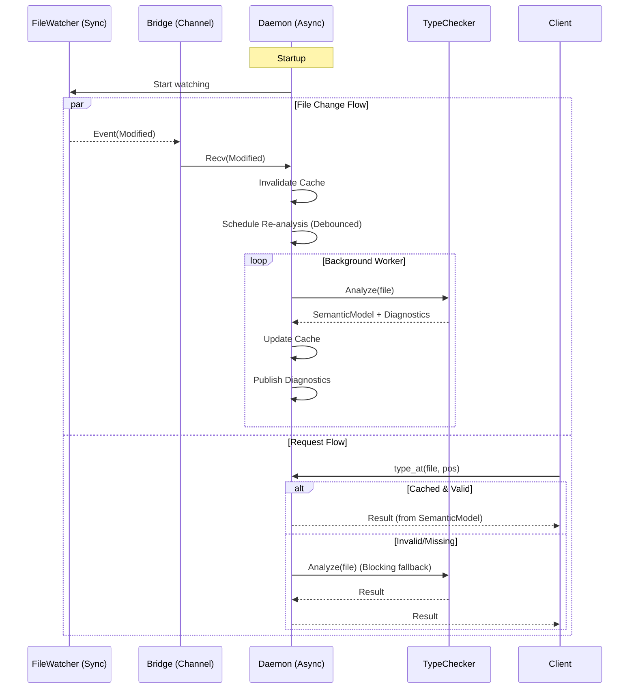

# Specification: Argus Daemon

<meta>
  <constraint>NO actual implementation code - use abstractions only</constraint>
  <abstractions>Mermaid, JSON Schema, Pseudo code, WHEN/THEN</abstractions>
</meta>

## Overview

The Argus Daemon is a long-running background process that maintains a live index of a codebase. It provides fast, incremental code analysis via a JSON-RPC interface over Unix Domain Sockets.

To support deep type analysis without blocking the main thread, the daemon employs an asynchronous architecture where file events trigger background re-analysis.

## Requirements

### R5: Live Code Indexing
The daemon SHALL maintain an in-memory `SemanticModel` and diagnostic cache for all analyzable files.
- The `SemanticModel` MUST be an owned, serializable structure independent of the source string lifetime.
- It MUST map AST ranges to `SymbolId`s and `TypeInfo`.

### R6: Incremental Background Updates
The daemon SHALL watch for file system changes and automatically:
1.  Invalidate the cache for changed files immediately.
2.  Schedule a background re-analysis (debounced).
3.  Update the cache when analysis completes.

### R7: Fast JSON-RPC Interface
The daemon SHALL provide a JSON-RPC 2.0 interface over a Unix Domain Socket.

### R8: Deep Type Analysis
The daemon SHALL use the advanced `TypeChecker` to resolve types. The `TypeChecker` MUST produce a `SemanticModel` that supports:
- `type_at(line, col)`: Return type of expression at position.
- `definition(line, col)`: Return location of symbol definition.
- `references(line, col)`: Return all references to symbol.

### R9: Async Event Bridging
The daemon SHALL bridge synchronous `FileWatcher` events into the async Tokio runtime using a dedicated channel, ensuring no blocking of the reactor loop.

## Flow



## Data Model

### Semantic Model (In-Memory)
```rust
struct SemanticModel {
    // Map ranges to symbol IDs for lookups
    scopes: IntervalTree<ScopeId>,
    symbols: HashMap<SymbolId, SymbolData>,
    references: IntervalTree<SymbolId>, // Maps usage range to def ID
    types: IntervalTree<TypeInfo>,      // Maps expression range to Type
}

struct SymbolData {
    name: String,
    kind: SymbolKind,
    def_range: Range,
    file_path: PathBuf,
    type_info: TypeInfo,
}
```

**Architecture Note**: The new `SemanticModel` in `types/model.rs` provides an owned, serializable representation built from the type checker. It coexists with the existing `semantic::SymbolTable` which provides a complementary view. The `RequestHandler` uses `SemanticModel` when available, falling back to `SymbolTable` for backward compatibility.

### JSON-RPC Response Schemas

#### `hover` Result
```json
{
  "contents": {
    "kind": "markdown",
    "value": "```python\ndef foo(x: int) -> str\n```\nDocumentation string..."
  },
  "range": {
    "start": { "line": 0, "character": 10 },
    "end": { "line": 0, "character": 13 }
  }
}
```

#### `definition` Result
```json
[
  {
    "uri": "file:///path/to/file.py",
    "range": {
      "start": { "line": 10, "character": 4 },
      "end": { "line": 10, "character": 7 }
    }
  }
]
```

#### `references` Result
```json
[
  {
    "uri": "file:///path/to/file.py",
    "range": { ... }
  },
  {
    "uri": "file:///path/to/other.py",
    "range": { ... }
  }
]
```

#### `index_status` Result
```json
{
  "indexed_files": 150,
  "total_symbols": 1234,
  "last_updated": null,
  "is_ready": true
}
```

**Note**: `queue_size` is not tracked in the initial implementation. `last_updated` is optional and may be `null` if not yet tracked.

## Interfaces

```
FUNCTION handle_request(request: Request) -> Result<Response, RpcError>
  INPUT: JSON-RPC request
  OUTPUT: JSON-RPC response
  ERRORS: MethodNotFound, InvalidParams, InternalError

FUNCTION process_file_change(path: Path) -> void
  INPUT: Path of changed file
  SIDE_EFFECTS: 
    1. Removes entry from cache
    2. Pushes path to analysis_queue

FUNCTION run_background_analysis() -> void
  INPUT: None (consumes analysis_queue)
  SIDE_EFFECTS: 
    1. Reads file source
    2. Runs TypeChecker
    3. Updates cache with new SemanticModel
```

## Acceptance Criteria

### Scenario: WHEN file changed THEN re-analyzed in background
- **WHEN** a file is modified on disk
- **THEN** the daemon should invalidate the cache immediately
- **AND** the cache should eventually be updated without further user requests
- **Note**: Queue tracking is not implemented in the initial version

### Scenario: WHEN type_at request is cached THEN return result fast
- **WHEN** a `type_at` request is sent for a file that was previously analyzed
- **THEN** the response should be returned in less than 5ms (measured by client-side timer)
- **AND** the response should contain the correct type information

### Scenario: WHEN hover requested THEN return markdown
- **WHEN** `hover` is requested for a function definition
- **THEN** the response should contain a markdown block with the function signature and docstring
