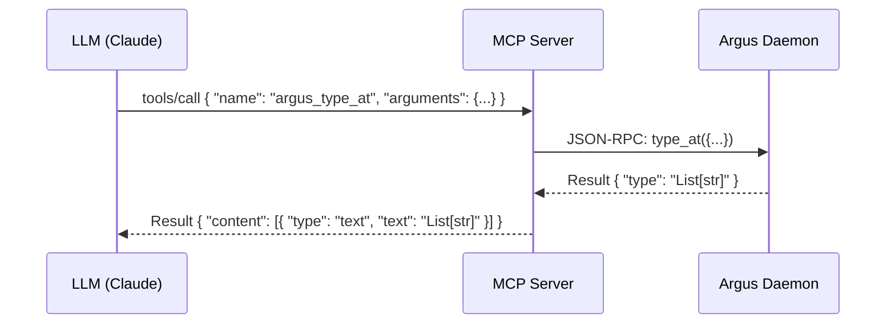

# Specification: Argus MCP Server

<meta>
  <constraint>NO actual implementation code - use abstractions only</constraint>
  <abstractions>Mermaid, JSON Schema, Pseudo code, WHEN/THEN</abstractions>
</meta>

## Overview

The Argus MCP Server implements the Model Context Protocol (MCP), enabling LLMs like Claude to interact with the Argus code analysis engine. It acts as a bridge between the MCP stdio transport and the Argus Daemon's Unix socket protocol.

## Requirements

### R1: Stdio Transport
The server SHALL communicate with the MCP host (e.g., Claude Desktop) via standard input and output using the JSON-RPC based MCP protocol.

### R2: Daemon Bridge
The server SHALL forward tool calls to the Argus Daemon via Unix sockets and format the results as MCP content blocks.

### R3: Tool Exposure
The server SHALL expose the following tools to the LLM:
- `argus_check`: Run full analysis on a path.
- `argus_type_at`: Get the type of an expression at a position.
- `argus_symbols`: List all symbols in a file.
- `argus_diagnostics`: Get all diagnostics for a file.
- `argus_hover`: Get documentation and signature for a symbol.
- `argus_definition`: Find the definition of a symbol.
- `argus_references`: Find all references to a symbol.
- `argus_index_status`: Get the current index status.
- `argus_invalidate`: Invalidate cache for specific files.

### R4: Configuration Generation
The system SHALL provide a mechanism to generate the necessary configuration for MCP clients to connect to the Argus MCP server.

## Flow



## Data Model

### MCP Tool Definition (argus_type_at)
```json
{
  "name": "argus_type_at",
  "description": "Get the type information for a symbol at a specific location",
  "inputSchema": {
    "type": "object",
    "properties": {
      "file": { "type": "string", "description": "Path to the file" },
      "line": { "type": "integer", "description": "0-indexed line number" },
      "column": { "type": "integer", "description": "0-indexed column number" }
    },
    "required": ["file", "line", "column"]
  }
}
```

## Interfaces

```
FUNCTION run_mcp_server() -> void
  INPUT: None (reads from stdin)
  OUTPUT: None (writes to stdout)
  SIDE_EFFECTS: Connects to Argus Daemon, enters blocking loop

FUNCTION map_tool_to_daemon(tool_name: string, args: Value) -> Result<Value, Error>
  INPUT: MCP tool name and arguments
  OUTPUT: JSON result for MCP tool response
  ERRORS: UnknownTool, DaemonNotRunning, AnalysisError
```

## Acceptance Criteria

### Scenario: WHEN argus_type_at called THEN return resolved type
- **WHEN** the LLM calls `argus_type_at` with a valid file and position
- **THEN** the MCP server should return a text content block containing the resolved type
- **AND** the request should be fulfilled by the Argus Daemon

### Scenario: WHEN daemon is missing THEN return helpful error
- **WHEN** an MCP tool is called but the Argus Daemon is not running
- **THEN** the MCP server should return an error message instructing the user to start the daemon with `ob argus server`

### Scenario: WHEN config requested THEN output JSON config
- **WHEN** the command `ob argus mcp` is executed
- **THEN** it should output a JSON object compatible with Claude Desktop's `mcpServers` configuration