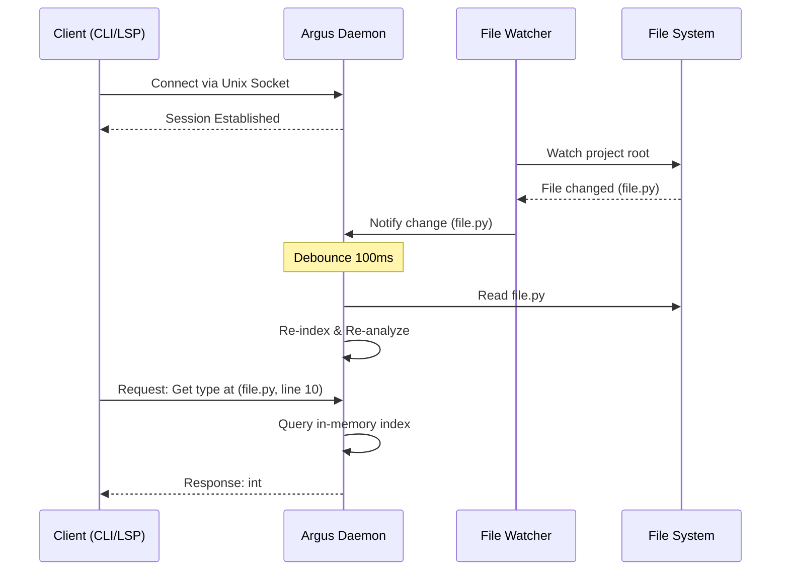

# Specification: Daemon Mode

<meta>
  <constraint>NO actual implementation code - use abstractions only</constraint>
  <abstractions>Mermaid, JSON Schema, Pseudo code, WHEN/THEN</abstractions>
</meta>

## Overview

The Daemon Mode provides a long-running background process that maintains an in-memory index of the workspace. This enables ultra-fast, incremental analysis and serves as the backend for the MCP server and LSP, reducing latency to sub-100ms for common queries.

## Requirements

### R1: Persistent Workspace Index
The daemon SHALL maintain a hot, in-memory representation of the project's dependency graph, symbol tables, and type information.

### R2: Unix Socket IPC
The daemon SHALL communicate with clients (CLI, LSP, MCP) via a high-performance Unix domain socket using a JSON-RPC 2.0 based protocol.

### R3: Debounced Incremental Re-indexing
The daemon SHALL integrate with a file system watcher and automatically trigger re-analysis of affected files, debounced by 100ms to handle rapid save operations.

### R4: Session Management
The daemon SHALL support multiple concurrent client sessions and handle workspace configuration changes (e.g., `pyproject.toml` updates) without restarting.

## Flow

## Acceptance Criteria

### Scenario: Rapid Incremental Analysis
- **WHEN** a file is saved and a type query is sent 150ms later
- **THEN** the daemon should return the updated type information from its warm cache.

### Scenario: Concurrent Client Access
- **WHEN** an LSP client and an MCP client are connected simultaneously
- **THEN** both should receive consistent analysis results without blocking each other.

### Scenario: Configuration Hot-Reload
- **WHEN** `pyproject.toml` is modified to change type checking strictness
- **THEN** the daemon should detect the change and re-analyze the workspace with the new settings.
