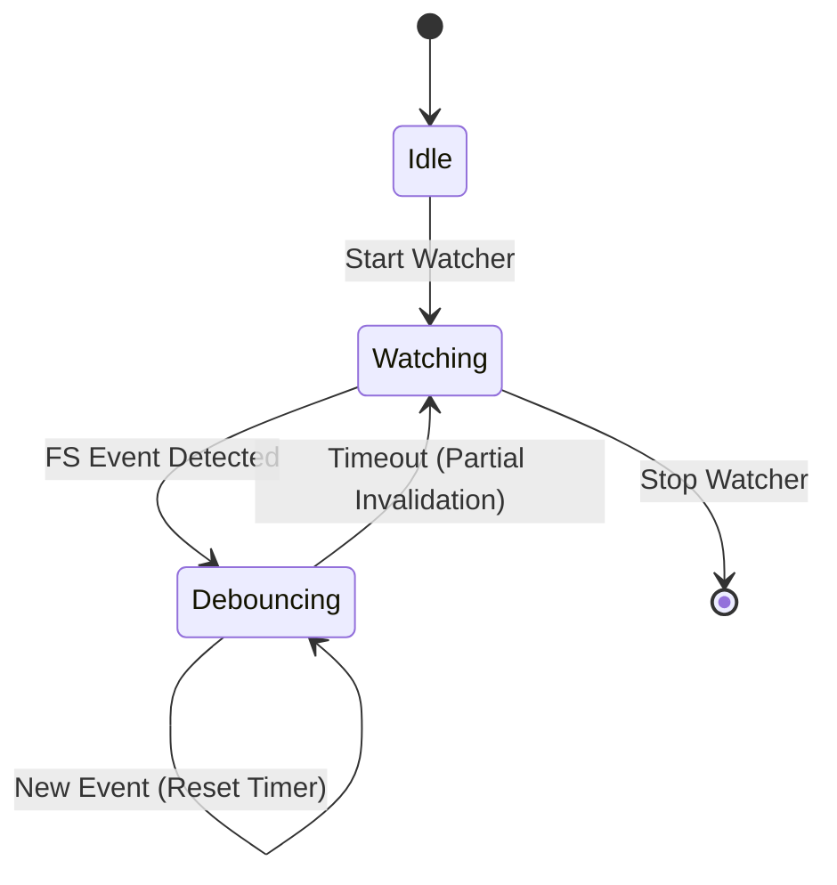

# Specification: Watch Mode

<meta>
  <constraint>NO actual implementation code - use abstractions only</constraint>
  <abstractions>Mermaid, JSON Schema, Pseudo code, WHEN/THEN</abstractions>
</meta>

## Overview

Watch mode allows Argus to react instantly to file system changes. By integrating a file watcher directly into the Argus Daemon, we can maintain a "warm" state where analysis results are updated as soon as the user saves a file.

## Requirements

### R1: Daemon-owned Watcher
The file watcher SHALL be owned and managed by the Argus Daemon. It MUST monitor the workspace root and all relevant Python source directories.

### R2: Debounced Re-analysis
File system events (created, modified, deleted) SHALL be debounced (default 100ms) to prevent excessive CPU usage during bulk operations like `git checkout` or rapid saves.

### R3: Targeted Invalidation
When a file changes, the system SHALL only invalidate the analysis of that file and its immediate dependants, rather than re-analyzing the whole project.

### R4: CLI Watch Integration
The CLI SHALL provide an `argus watch` command that starts/connects to the daemon and displays a live stream of diagnostics as files are changed.

## State

## Acceptance Criteria

### Scenario: Live Diagnostic Updates
- **WHEN** a type error is introduced and the file is saved
- **THEN** the CLI watch command should show the new error within 500ms.

### Scenario: Mass File Change (Git)
- **WHEN** 100 files are updated simultaneously (e.g., via git pull)
- **THEN** the watcher should debounce the events and perform a single batched re-indexing.

### Scenario: New File Discovery
- **WHEN** a new `.py` file is created in the workspace
- **THEN** the watcher should detect it and add its symbols to the global index.
