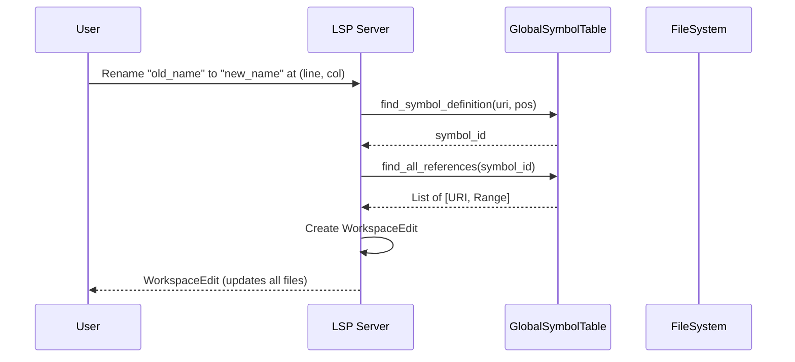

# Specification: Advanced LSP Features

<meta>
  <constraint>NO actual implementation code - use abstractions only</constraint>
  <abstractions>Mermaid, JSON Schema, Pseudo code, WHEN/THEN</abstractions>
</meta>

## Overview

Extend the LSP server with advanced features: global rename, find all references, and extensible code actions. These features are essential for a production-ready IDE experience.

## Requirements

### R1: Global Rename
Implement `textDocument/rename`. When a symbol is renamed, all references in the workspace must be updated.

### R2: Find References
Implement `textDocument/references`. Must find all occurrences of a symbol across the entire workspace, distinguishing between declarations and usages.

### R3: Extensible Code Actions
Implement a framework for `textDocument/codeAction` that allows adding more complex refactorings (e.g., "Extract Method", "Add Type Hint") beyond simple quick fixes.

### R4: Workspace Indexing
Maintain a global index of symbols across all files in the workspace to support cross-file lookups (rename, references). This index must be incrementally updated when files change.
- **Precedence**: For open documents, LSP in-memory text takes precedence over filesystem content. The index is updated from `didChange`/`didSave` for open files. File watcher events only affect non-open files.
- **Symbol Identity**: Use fully-qualified symbol IDs (module path + scope path + name) to disambiguate same-name symbols across modules. Integrate import resolution via `ModuleGraph` to resolve cross-file references correctly.

## Flow

## Acceptance Criteria

### Scenario: WHEN rename in file THEN update all occurrences
- **WHEN** user renames `user_id` to `account_id`
- **THEN** all occurrences of `user_id` in the current file are updated to `account_id`

### Scenario: WHEN rename across modules THEN update imports
- **WHEN** user renames a function `process_data` in `engine.py`
- **THEN** calls to `process_data` in `main.py` and `tests.py` are also updated

### Scenario: WHEN find references THEN return all usages
- **WHEN** user requests references for class `User`
- **THEN** Argus returns the class definition, all instantiations (e.g., `User()`), and all type annotations (e.g., `def f(u: User)`)

### Scenario: WHEN diagnostic present THEN offer code action
- **WHEN** a diagnostic is emitted that has a registered code action (e.g., "unknown-type" or custom "missing-type-hint" lint)
- **THEN** the corresponding Code Action (e.g., "Add type hint 'Any'") is offered to the user

### Scenario: WHEN file changed THEN update workspace index
- **WHEN** a file is modified and saved
- **THEN** the workspace index is updated with the new symbols from that file

### Scenario: WHEN file deleted THEN remove symbols from index
- **WHEN** a file is deleted from the workspace
- **THEN** all symbols defined in that file are removed from the global index

### Scenario: WHEN file renamed THEN update symbol locations
- **WHEN** a file is renamed (e.g., `a.py` -> `b.py`)
- **THEN** the index updates the location URI for all symbols in that file
