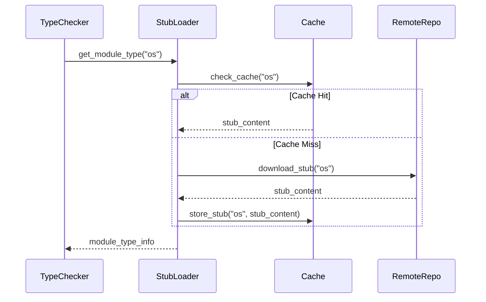

# Specification: Dynamic Typeshed Integration

<meta>
  <constraint>NO actual implementation code - use abstractions only</constraint>
  <abstractions>Mermaid, JSON Schema, Pseudo code, WHEN/THEN</abstractions>
</meta>

## Overview

Implement runtime downloading and caching of typeshed stubs to replace the current limited bundled stubs. This enables Argus to provide type information for the entire Python standard library without shipping large static files.

## Requirements

### R1: Stub Downloader
The system must be able to download typeshed stubs for a specific Python version from a remote repository (e.g., GitHub).
- **Non-blocking Strategy**: Downloads run in a background thread. Type checking uses cached/bundled stubs immediately and refreshes later when download completes. Never block LSP or analysis on network I/O.

### R2: Local Cache Management
Downloaded stubs must be cached locally to avoid redundant network requests. The cache should support versioning and invalidation.
- **Note**: The cache key should include the Python version (e.g., `3.10`, `3.11`) to ensure correct stubs are loaded for the target environment.

### R3: On-demand Loading
Stubs should be loaded into the type environment only when a module is imported in the code being analyzed.

### R4: Conflict Resolution
If both a local stub and a typeshed stub exist, the system should prioritize based on user configuration.

### R5: Configuration
Provide configuration options for the typeshed integration, including:
- `typeshed_path`: Custom path to a local typeshed copy.
- `cache_dir`: Directory to store downloaded stubs.
- `offline`: Boolean flag to disable network requests.
- `stub_precedence`: Policy for resolving conflicts (default to local > typeshed).

### R6: Typeshed Source and Resolution
The default source for stubs is the official `python/typeshed` repository on GitHub.
- **Source**: `https://github.com/python/typeshed`
- **Resolution Strategy**: On first use, download the typeshed tree index (list of modules and paths) for the target Python version. Store this index in cache. Map module names to paths using the index (e.g., `os` -> `stdlib/os/__init__.pyi`).
- **Update Cadence**: Cache has a configurable TTL (default: 7 days). Check for updates on first use after TTL expires. For short-lived CLI runs, only fetch if cache is missing or expired.
- **Versioning**: Uses the `main` branch by default, but allows pinning to a specific commit hash in configuration for reproducibility.

## Flow



## Data Model

```json
{
  "$schema": "http://json-schema.org/draft-07/schema#",
  "type": "object",
  "required": ["version", "modules"],
  "properties": {
    "version": { "type": "string", "description": "Typeshed version or commit hash" },
    "modules": {
      "type": "object",
      "additionalProperties": {
        "type": "object",
        "properties": {
          "path": { "type": "string" },
          "last_updated": { "type": "string", "format": "date-time" },
          "etag": { "type": "string" }
        }
      }
    }
  }
}
```

## Acceptance Criteria

### Scenario: WHEN user imports uncached module THEN stub is downloaded
- **WHEN** user imports a standard library module not currently in cache (e.g., `bisect`)
- **THEN** Argus downloads the stub, caches it, and provides type information for `bisect.insort`

### Scenario: WHEN offline and stub missing from all sources THEN fallback to Any
- **WHEN** Argus is offline and a required stub is not in cache and not in bundled stubs
- **THEN** Argus falls back to `Any` for the module and logs a warning instead of failing

### Scenario: WHEN offline and bundled stub exists THEN use bundled
- **WHEN** Argus is offline and the module has a bundled stub (not in cache or local .pyi)
- **THEN** Argus uses the bundled stub (precedence: Local .pyi > Downloaded Typeshed > Bundled stubs > Any)

### Scenario: WHEN stub cached THEN load from disk
- **WHEN** user imports `os` and the stub is already in the local cache
- **THEN** Argus loads the stub from disk without any network activity

### Scenario: WHEN module imported but unused THEN defer analysis
- **WHEN** a module is imported but not used
- **THEN** the stub is downloaded but full analysis is deferred until a symbol is accessed

### Scenario: WHEN local stub exists THEN prioritize local
- **WHEN** a user provides a local `.pyi` file for a module also in typeshed
- **THEN** the local file takes precedence
