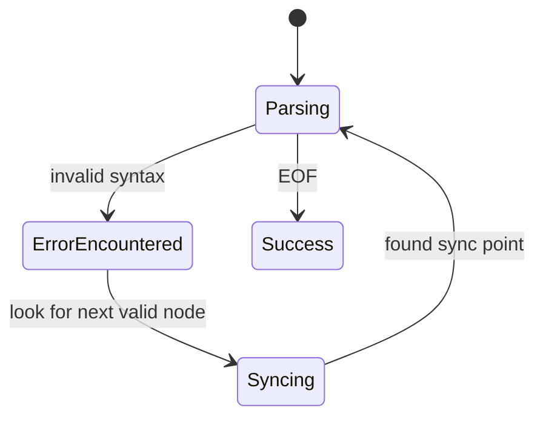

# Specification: Error Recovery for AST Analysis

<meta>
  <constraint>NO actual implementation code - use abstractions only</constraint>
  <abstractions>Mermaid, JSON Schema, Pseudo code, WHEN/THEN</abstractions>
</meta>

## Overview

Enhance the AST analysis to gracefully handle incomplete or invalid syntax, ensuring that type checking continues for valid portions of the file. This is critical for IDE usage where code is often in an incomplete state during editing.

## Requirements

### R1: Parser Synchronization
When the tree-sitter parser encounters an error node, the semantic analyzer should skip to the next recognizable synchronization point (e.g., next statement, next function definition).

### R2: Partial Symbol Table Construction
The symbol table should be built even if some parts of the file are unparseable. Symbols defined before or after the error should still be available.

### R3: Placeholder Types
Unresolved expressions in an error context should be assigned a special `ErrorType` or `Any` to prevent cascading type errors.

## Flow

## Acceptance Criteria

### Scenario: WHEN statement incomplete THEN recover at boundary
- **WHEN** a statement is missing a closing parenthesis
- **THEN** Argus recovers at the next newline or semicolon and continues analyzing the subsequent statements

### Scenario: WHEN syntax error in function THEN symbol table intact
- **WHEN** user is typing `def foo(): x = 1 + ` (incomplete expression)
- **THEN** Argus reports a syntax error at the incomplete line but still recognizes `foo` in the symbol table and provides hover info for `x` if possible

### Scenario: WHEN multiple errors THEN analyze valid code
- **WHEN** a file has syntax errors in two separate functions
- **THEN** Argus reports both errors and correctly analyzes a third, valid function in the same file

### Scenario: WHEN assignment fails THEN assign ErrorType
- **WHEN** an assignment fails to parse
- **THEN** the variable is assigned `ErrorType` to suppress further "undefined variable" errors
