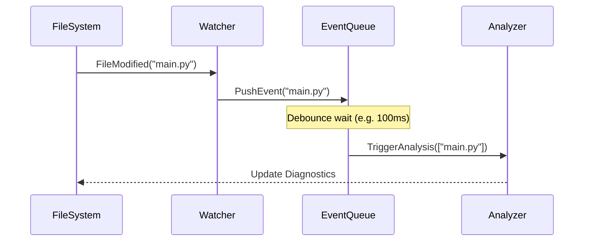

# Specification: Watch Mode

<meta>
  <constraint>NO actual implementation code - use abstractions only</constraint>
  <abstractions>Mermaid, JSON Schema, Pseudo code, WHEN/THEN</abstractions>
</meta>

## Overview

Add file system monitoring to automatically re-analyze files when they change. This enables real-time feedback during development without requiring manual re-runs of the type checker.

## Requirements

### R1: File System Monitoring
Use the `notify` crate to watch for file creation, modification, and deletion in the project root.

### R2: Incremental Re-analysis
Only re-analyze files that changed. When a file is modified, also re-analyze all files that import it (conservative approach - any change triggers dependent re-analysis to avoid complex interface-change detection).

### R3: Debouncing
Group multiple rapid file events (e.g., from a 'save all' or git operation) into a single analysis pass to save resources.

## Flow

## Acceptance Criteria

### Scenario: WHEN file saved THEN refresh diagnostics
- **WHEN** user modifies and saves `utils.py`
- **THEN** Argus automatically detects the change and refreshes diagnostics for `utils.py`

### Scenario: WHEN interface changes THEN propagate analysis
- **WHEN** `shared.py` is modified such that a function signature changes
- **THEN** Argus re-analyzes `shared.py` AND any other files that import `shared.py`

### Scenario: WHEN rapid changes THEN single analysis
- **WHEN** 5 files are updated within 50ms (e.g., during a bulk replace)
- **THEN** Argus triggers exactly one analysis pass after the debounce period
