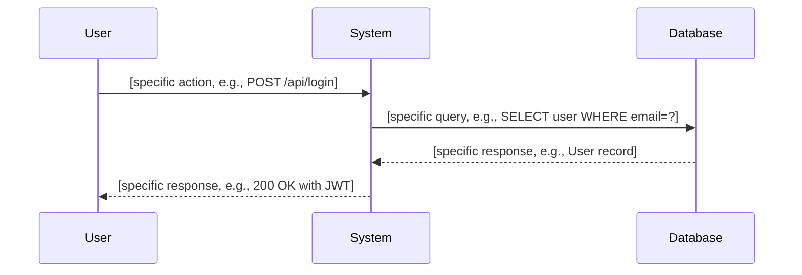
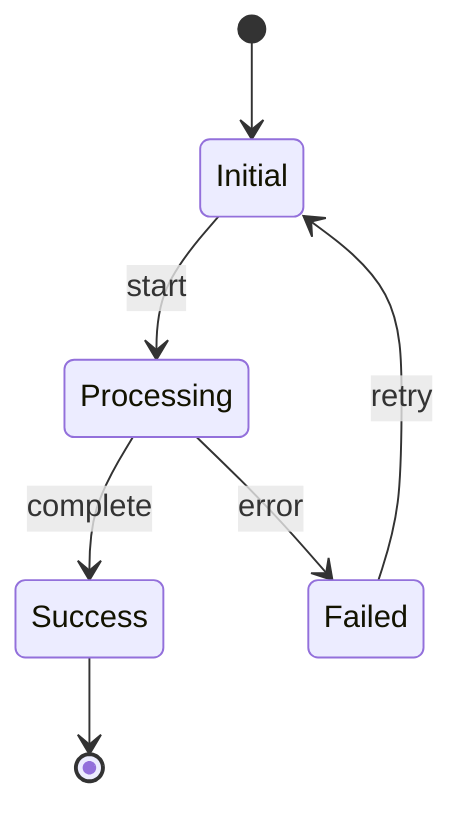

# Specification: [Feature Name]

<meta>
  <constraint>NO actual implementation code - use abstractions only</constraint>
  <abstractions>Mermaid, JSON Schema, Pseudo code, WHEN/THEN</abstractions>
</meta>

<section id="overview" required="true">
## Overview

[Brief description of what this spec covers and why it exists]

<quality>
- Be specific about the problem being solved
- Explain the scope and boundaries
- One paragraph, not bullet points
</quality>
</section>

<section id="requirements" required="true">
## Requirements

<format>### R{n}: {Title}</format>

### R1: [First Requirement Title]
[Description of the requirement - what it must do, not how]

### R2: [Second Requirement Title]
[Description of the requirement]

<quality>
- Each requirement should be testable
- Use clear, measurable language
- Focus on WHAT, not HOW
</quality>
</section>

<section id="flow" required="false">
## Flow

<format>Mermaid sequenceDiagram with specific actors and messages</format>



<quality>
- Name participants specifically (not just "User" and "System")
- Show actual API calls, method names, or messages
- Include error paths if relevant
</quality>
</section>

<section id="state" required="false">
## State (if applicable)

<format>Mermaid stateDiagram-v2 with clear states and transitions</format>



<quality>
- Only include if the feature has meaningful state transitions
- Label all transitions with triggering events
</quality>
</section>

<section id="data-model" required="false">
## Data Model

<format>JSON Schema with $schema, type, required, properties</format>

```json
{
  "$schema": "http://json-schema.org/draft-07/schema#",
  "type": "object",
  "required": ["id", "name"],
  "properties": {
    "id": { "type": "string", "format": "uuid", "description": "Unique identifier" },
    "name": { "type": "string", "minLength": 1, "maxLength": 255 },
    "status": { "type": "string", "enum": ["active", "inactive", "pending"] },
    "created_at": { "type": "string", "format": "date-time" }
  }
}
```

<quality>
- Include required fields array
- Add constraints (minimum, maximum, enum, format)
- Add descriptions for non-obvious fields
</quality>
</section>

<section id="interfaces" required="false">
## Interfaces

<format>FUNCTION name(params) -> Result with INPUT, OUTPUT, ERRORS</format>

```
FUNCTION function_name(param1: Type, param2: Type) -> Result<OutputType, ErrorType>
  INPUT: Description of inputs and constraints
  OUTPUT: Description of successful output
  ERRORS: ErrorType1 (when X), ErrorType2 (when Y)

FUNCTION another_function(data: DataType) -> void
  INPUT: Description of input
  SIDE_EFFECTS: What state it modifies
  ERRORS: Possible error conditions
```

<quality>
- Include error cases and when they occur
- Specify side effects for mutations
- Use consistent naming conventions
</quality>
</section>

<section id="acceptance-criteria" required="true">
## Acceptance Criteria

<format>### Scenario: {Name} with - **WHEN** and - **THEN**</format>

### Scenario: [Happy Path]
- **WHEN** [trigger condition with specific values]
- **THEN** [expected behavior with specific outcomes]

### Scenario: [Error Case]
- **WHEN** [error condition]
- **THEN** [error handling behavior]

### Scenario: [Edge Case]
- **WHEN** [edge case condition]
- **THEN** [expected behavior]

<quality>
- Cover happy path, error cases, and edge cases
- Use specific values in examples (not "[value]")
- Each scenario should be independently testable
- Minimum 3 scenarios required
</quality>
</section>
