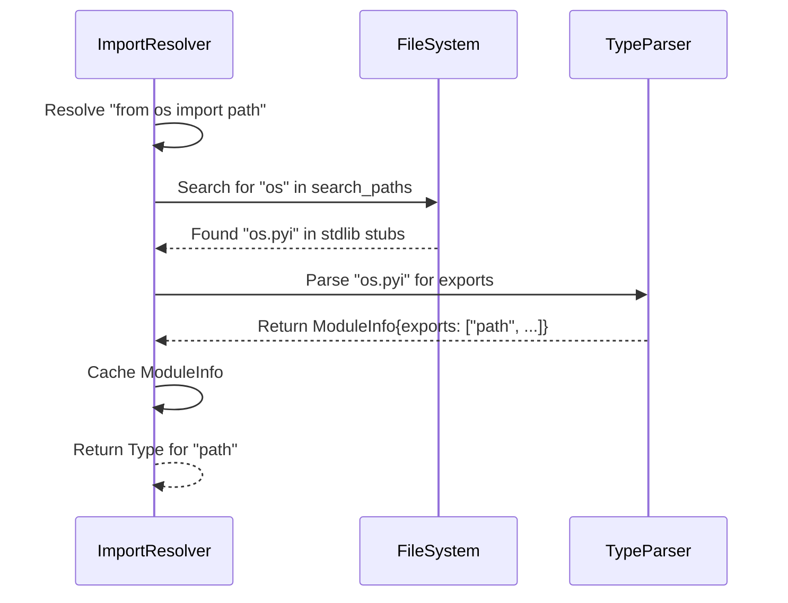

# Specification: Cross-File Import Resolution

## Overview

This specification defines the enhanced logic for `ImportResolver` to handle cross-file module resolution, including project-internal imports, standard library modules, and third-party packages found in `site-packages`.

## Requirements

### R1: Project-Internal Resolution
The system SHALL resolve imports to other `.py` or `.pyi` files within the project root based on the configured search paths.

### R2: Site-Packages Resolution
The system SHALL resolve imports to installed packages in the detected virtual environment's `site-packages` directory.

### R3: Stub File Priority
When resolving a module, the system SHALL prefer `.pyi` (stub) files over `.py` files if both exist, as stubs provide more accurate type information.

### R4: Package Indexing
The system SHALL be capable of indexing available modules in the search paths to allow quick lookup and listing of available modules.

### R5: On-Demand Loading
The system SHALL load and parse imported modules only when they are first referenced (lazy loading) to minimize memory usage for large dependency trees.

## Flow



## Interfaces

```
FUNCTION resolve_module(module_name: String) -> Option<PathBuf>
  INPUT: Fully qualified module name (e.g., "django.db.models")
  OUTPUT: Path to the .py or .pyi file
  
FUNCTION get_module_info(module_name: String) -> Result<ModuleInfo, ResolveError>
  INPUT: Module name
  OUTPUT: ModuleInfo containing exported types and metadata
  SIDE_EFFECTS: Parses the file and caches the result
```

## Acceptance Criteria

### Scenario: WHEN local module imported THEN resolve from src
- **WHEN** Project has `src/utils.py` and a file imports `from src.utils import helper`
- **THEN** `ImportResolver` finds `src/utils.py` and extracts the type of `helper`.

### Scenario: WHEN library imported THEN resolve from site-packages
- **WHEN** `requests` is installed in the active venv and a file imports `import requests`
- **THEN** `ImportResolver` finds the `requests` package in `site-packages` and loads its top-level exports.

### Scenario: WHEN circular import occurs THEN handle gracefully
- **WHEN** `module_a` imports `module_b` and `module_b` imports `module_a`
- **THEN** The system handles the resolution without infinite recursion (e.g., by using a "loading" state in the cache).
