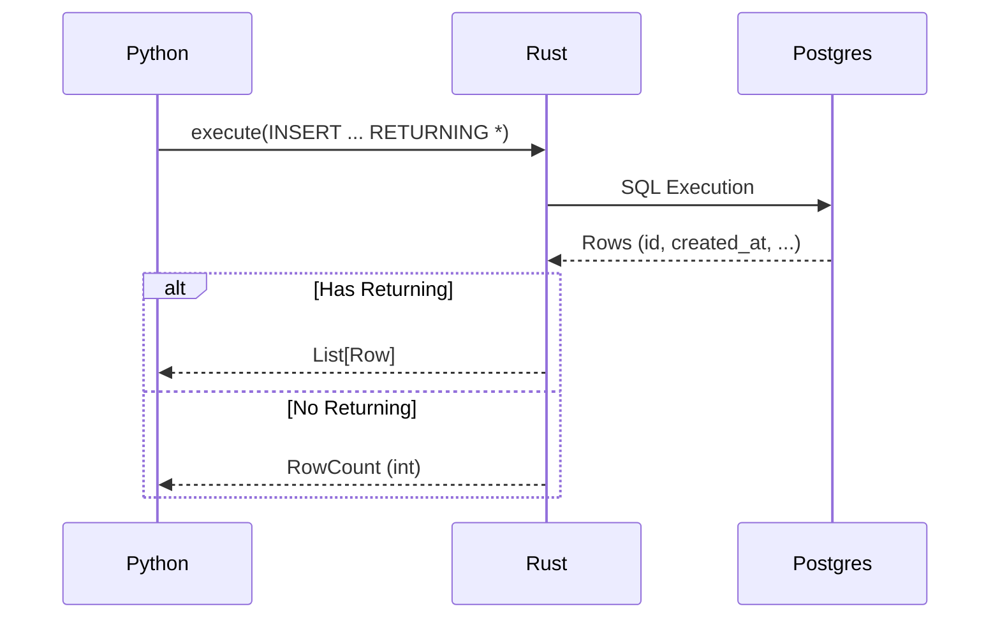

# Specification: Correctness Fixes

## Overview

Address known integration test failures in `ouroboros-postgres` related to `INSERT ... RETURNING` behavior and `DECIMAL` type serialization.

## Requirements

### R1: INSERT with RETURNING
When an INSERT statement includes a `RETURNING` clause, the execution result MUST include the returned rows. Currently, it returns the number of affected rows (u64), causing `test_execute_insert_with_returning` to fail.

### R2: DECIMAL Type Serialization
The system MUST correctly serialize and deserialize PostgreSQL `NUMERIC`/`DECIMAL` types to/from Python `Decimal` objects (via `rust_decimal` and string representation if needed) to fix `test_execute_aggregate_query`.

## Flow

### INSERT Execution

## Acceptance Criteria

### Scenario: WHEN insert with returning THEN return rows
- **WHEN** executing an INSERT statement with a RETURNING clause
- **THEN** the result is a list of rows containing the returned values

### Scenario: WHEN insert without returning THEN return count
- **WHEN** executing an INSERT statement without a RETURNING clause
- **THEN** the result is the integer count of inserted rows

### Scenario: WHEN aggregate decimal THEN return python decimal
- **WHEN** executing a query that returns a SUM or AVG of a numeric column
- **THEN** the result is correctly converted to a Python Decimal object (or compatible string/float)