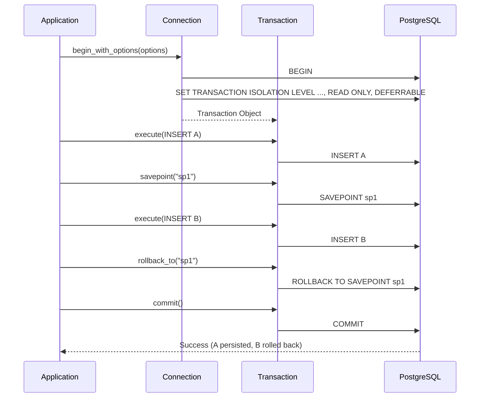

<spec>
# Specification: Ouroboros Postgres Transaction Integration Tests

<meta>
  <constraint>NO actual implementation code - use abstractions only</constraint>
  <abstractions>Mermaid, JSON Schema, Pseudo code, WHEN/THEN</abstractions>
</meta>

## Overview

This specification defines the integration tests required to verify the correctness and reliability of transaction management in the `ouroboros-postgres` crate. It ensures that ACID properties are strictly maintained across various PostgreSQL-specific configurations, including isolation levels, savepoints, and transaction options. These tests validate that data remains consistent and that database connections are properly managed through automatic rollbacks on drop, preventing resource leaks and ensuring a clean state for subsequent operations.

## Requirements

### R1: Basic ACID Operations
The system must support explicit `commit` and `rollback` operations. `commit` must persist all changes made within the transaction to the database, while `rollback` must discard them.

### R2: PostgreSQL Isolation Levels
The system must correctly apply all supported PostgreSQL isolation levels (`READ UNCOMMITTED`, `READ COMMITTED`, `REPEATABLE READ`, `SERIALIZABLE`). The system must verify that the requested isolation level is active within the session.

### R3: Savepoint Management
The system must support named savepoints for partial rollbacks within a transaction. This includes `SAVEPOINT` creation, `ROLLBACK TO SAVEPOINT`, and `RELEASE SAVEPOINT`.

### R4: Automatic Rollback on Drop
If a `Transaction` object is dropped or goes out of scope without being explicitly committed or rolled back, it must automatically trigger a database rollback.

### R5: Transaction Options
The system must support `AccessMode` (READ WRITE and READ ONLY) and the `DEFERRABLE` flag for serializable transactions, ensuring correct `SET TRANSACTION` SQL generation and execution.

### R6: Nested Transaction Simulation
The system must verify that savepoints can be used to simulate nested transaction behavior, where nested logical units of work can be rolled back without affecting the parent transaction's progress.

## Flow



## Data Model

```json
{
  "$schema": "http://json-schema.org/draft-07/schema#",
  "title": "TransactionOptions",
  "type": "object",
  "required": ["isolation_level", "access_mode", "deferrable"],
  "properties": {
    "isolation_level": {
      "type": "string",
      "enum": ["ReadUncommitted", "ReadCommitted", "RepeatableRead", "Serializable"],
      "default": "ReadCommitted"
    },
    "access_mode": {
      "type": "string",
      "enum": ["ReadWrite", "ReadOnly"],
      "default": "ReadWrite"
    },
    "deferrable": {
      "type": "boolean",
      "default": false,
      "description": "Only meaningful for SERIALIZABLE READ ONLY transactions."
    }
  }
}
```

## Interfaces

```
FUNCTION Transaction::begin(conn: Connection, isolation_level: IsolationLevel) -> Result<Transaction>
  INPUT: Database connection, requested isolation level
  OUTPUT: Active transaction instance
  ERRORS: Connection issues, initialization failure

FUNCTION Transaction::begin_with_options(conn: Connection, options: TransactionOptions) -> Result<Transaction>
  INPUT: Database connection, full transaction configuration
  OUTPUT: Active transaction instance
  ERRORS: SQL execution error (e.g., invalid options combination)

FUNCTION Transaction::commit(self) -> Result<()>
  INPUT: The transaction instance (consumed)
  SIDE_EFFECTS: Finalizes changes in the database
  ERRORS: Commit failure (e.g., serialization conflict)

FUNCTION Transaction::rollback(self) -> Result<()>
  INPUT: The transaction instance (consumed)
  SIDE_EFFECTS: Discards all changes in the current transaction
  ERRORS: Rollback failure

FUNCTION Transaction::savepoint(name: String) -> Result<()>
  INPUT: Unique savepoint name
  SIDE_EFFECTS: Creates a marker for partial rollback
  ERRORS: Invalid identifier, DB error

FUNCTION Transaction::rollback_to(name: String) -> Result<()>
  INPUT: Target savepoint name
  SIDE_EFFECTS: Reverts all DB changes made since the savepoint was created
  ERRORS: Savepoint not found, DB error
```

## Acceptance Criteria

### Scenario: Successful Transaction Commit
- **WHEN** a transaction is started, a record with name "Alice" is inserted, and `commit()` is called.
- **THEN** querying the database after completion must return exactly 1 record with name "Alice".

### Scenario: Explicit Transaction Rollback
- **WHEN** a transaction is started, a record with name "Bob" is inserted, and `rollback()` is called.
- **THEN** querying the database after completion must NOT find any record with name "Bob".

### Scenario: Savepoint Partial Rollback
- **WHEN** Insert Record A -> Create Savepoint "sp1" -> Insert Record B -> Rollback to "sp1" -> Commit.
- **THEN** Record A must exist in the database, but Record B must NOT exist.

### Scenario: Nested Savepoint Stack Rollback
- **WHEN** Insert A -> SP1 -> Insert B -> SP2 -> Insert C -> Rollback to "sp1" -> Commit.
- **THEN** Only Record A must exist in the database.

### Scenario: Automatic Rollback on Drop
- **WHEN** a transaction is started, a record with name "Ghost" is inserted, and the `Transaction` object is dropped without calling `commit()`.
- **THEN** the record with name "Ghost" must NOT be present in the database.

### Scenario: Isolation Level Verification
- **WHEN** a transaction is started with `IsolationLevel::RepeatableRead`.
- **THEN** executing `SHOW transaction_isolation` must return `repeatable read`.

### Scenario: Read-Only Access Mode Enforcement
- **WHEN** a transaction is started with `AccessMode::ReadOnly`.
- **THEN** attempting to execute an `INSERT` statement must result in a database error (SQLState 25006).

### Scenario: Deferrable Serializable Transaction Initiation
- **WHEN** a transaction is started with `IsolationLevel::Serializable`, `AccessMode::ReadOnly`, and `deferrable(true)`.
- **THEN** the transaction must successfully begin and remain valid for read operations.
</spec>
