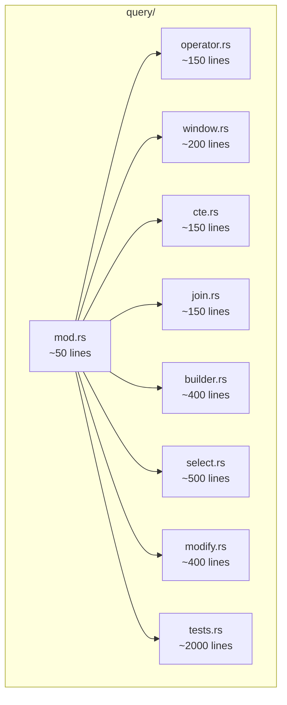
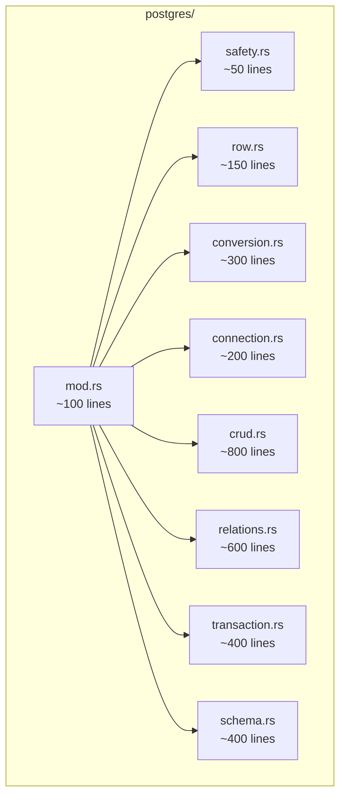
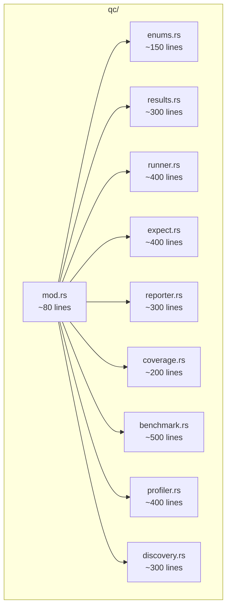
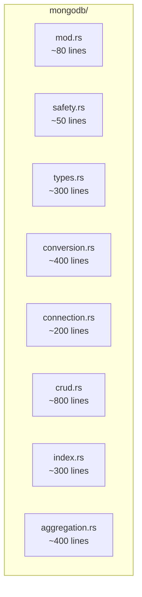

# Split Strategy Specification

## 1. Splitting Principles

### 1.1 Cohesion over Size
Do not split files arbitrarily just to reduce line count. Split boundaries must follow logical lines:
- **By Type:** Move large `enum` or `struct` definitions to `types.rs` or `model.rs`
- **By Feature:** Group related functionality (e.g., `insert`, `update`, `delete` logic) into separate modules
- **By Layer:** Separate serialization (`impl IntoPyObject`) from core logic
- **By Tests:** Move `#[cfg(test)] mod tests` to separate `tests.rs`

### 1.2 Module Organization
When a file `src/foo.rs` is split, it should become a directory `src/foo/` containing:
```
src/foo/
├── mod.rs      # pub mod + pub use re-exports only
├── types.rs    # Shared data structures
├── impl_a.rs   # Feature A implementation
├── impl_b.rs   # Feature B implementation
└── tests.rs    # Tests (if >200 lines)
```

### 1.3 Visibility Rules
- `pub(crate)` for internal helpers shared between sub-modules
- `pub(super)` for items used only within the parent module
- Maintain original public API via re-exports in `mod.rs`

### 1.4 Import Organization
```rust
// mod.rs pattern
mod types;
mod impl_a;
mod impl_b;

// Re-export public API (maintains backwards compatibility)
pub use types::*;
pub use impl_a::*;
pub use impl_b::*;
```

## 2. Proposed Module Structures

### 2.1 `ouroboros-postgres/src/query.rs` (4,430 lines) → `query/`


**Contents:**
- `operator.rs`: `Operator`, `OrderDirection` enums
- `window.rs`: `AggregateFunction`, `WindowFunction`, `WindowSpec`, `WindowExpression`
- `cte.rs`: `CommonTableExpression`, `Subquery`, `SetOperation`, `SetQuery`
- `join.rs`: `JoinType`, `JoinCondition`, `JoinClause`
- `builder.rs`: `QueryBuilder` struct and core methods
- `select.rs`: SELECT, WHERE, ORDER BY, GROUP BY implementations
- `modify.rs`: INSERT, UPDATE, DELETE implementations
- `tests.rs`: All `#[test]` functions

### 2.2 `ouroboros/src/postgres.rs` (4,206 lines) → `postgres/`


**Contents:**
- `safety.rs`: `safe_call` panic boundary wrapper
- `row.rs`: `RowWrapper`, `OptionalRowWrapper`, `RowsWrapper`
- `conversion.rs`: `py_value_to_extracted`, `extracted_to_py_value`, `extracted_to_json`
- `connection.rs`: `PG_POOL`, `init`, `close`, `is_connected`
- `crud.rs`: `insert_one`, `insert_many`, `fetch_one`, `fetch_all`, `update_*`, `delete_*`
- `relations.rs`: `fetch_*_with_relations`, `m2m_*` functions
- `transaction.rs`: `PyTransaction`, `begin_transaction`
- `schema.rs`: `list_tables`, `describe_table`, `table_exists`

### 2.3 `ouroboros/src/qc.rs` (3,987 lines) → `qc/`


### 2.4 `ouroboros/src/mongodb.rs` (3,684 lines) → `mongodb/`


## 3. Tracking Progress

### JSON Schema for `split-progress.json`
```json
{
  "$schema": "http://json-schema.org/draft-07/schema#",
  "type": "object",
  "properties": {
    "files": {
      "type": "array",
      "items": {
        "type": "object",
        "properties": {
          "path": { "type": "string" },
          "original_lines": { "type": "integer" },
          "status": { "enum": ["pending", "in-progress", "completed"] },
          "modules_created": { "type": "array", "items": { "type": "string" } },
          "max_new_file_lines": { "type": "integer" }
        },
        "required": ["path", "original_lines", "status"]
      }
    }
  }
}
```

### Example Progress Entry
```json
{
  "path": "crates/ouroboros-postgres/src/query.rs",
  "original_lines": 4430,
  "status": "completed",
  "modules_created": [
    "query/mod.rs",
    "query/operator.rs",
    "query/window.rs",
    "query/cte.rs",
    "query/join.rs",
    "query/builder.rs",
    "query/select.rs",
    "query/modify.rs",
    "query/tests.rs"
  ],
  "max_new_file_lines": 500
}
```

## 4. Acceptance Criteria

### Per-File Criteria
- [ ] Original file removed or converted to `mod.rs`
- [ ] No new file exceeds 500 lines (soft) / 1000 lines (hard)
- [ ] `cargo check` passes
- [ ] `cargo test` passes (no regression)
- [ ] Public API unchanged (`cargo doc` same exports)

### Overall Criteria
- [ ] All 21 files split successfully
- [ ] Total project compiles: `cargo build --all`
- [ ] All tests pass: `cargo test --all`
- [ ] Python bindings work: `maturin develop` in `crates/ouroboros`
- [ ] No increase in compilation time (within 10%)
