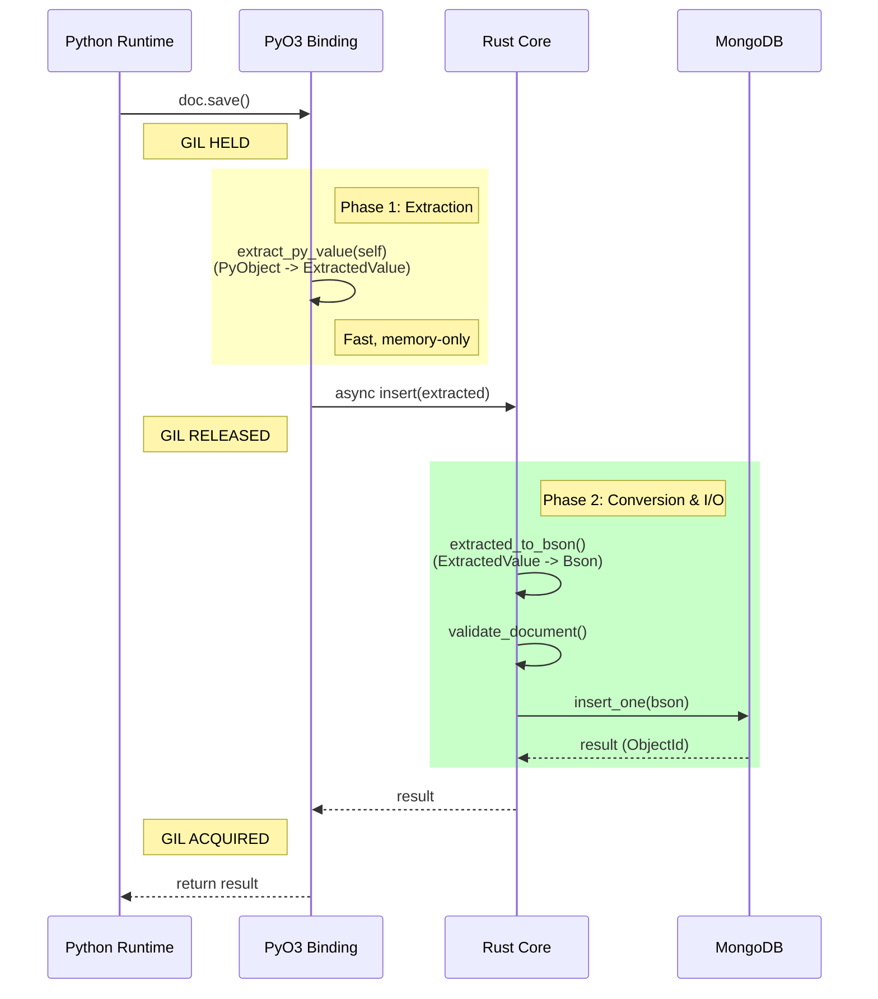
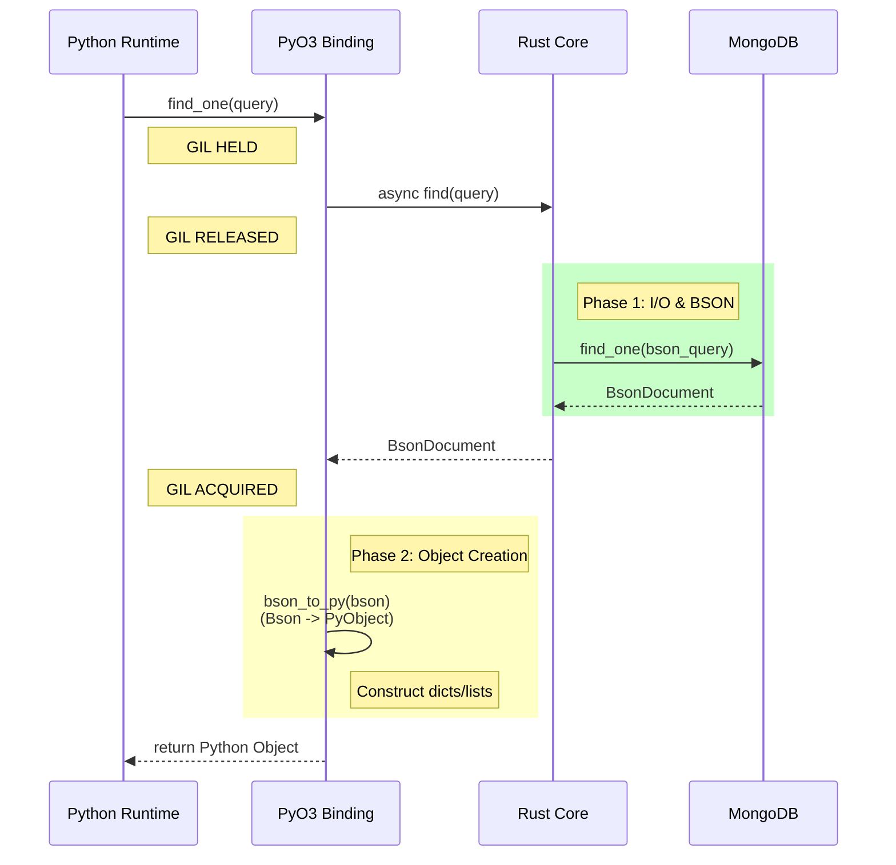
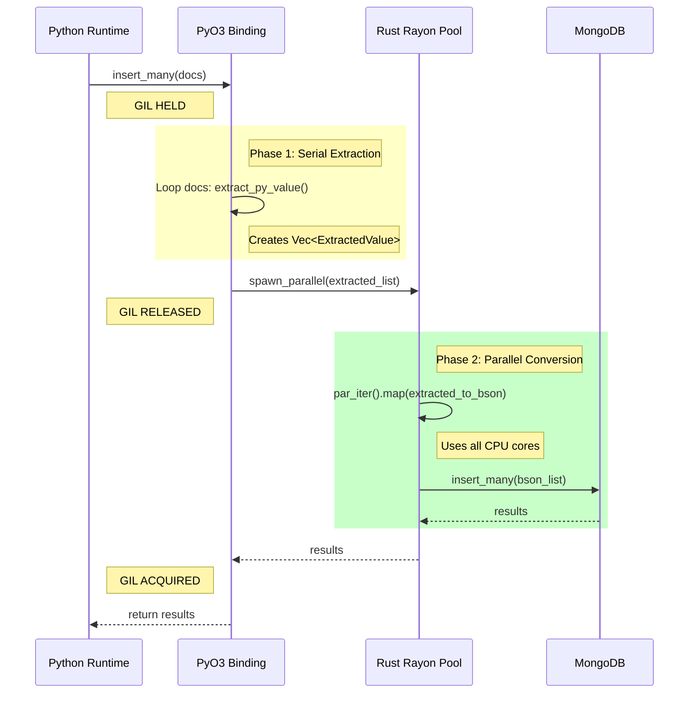
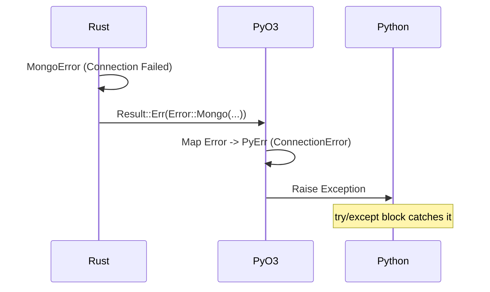

# Core MongoDB Data Flows

> Part of [Core MongoDB Engine Documentation](./index.md)

This document illustrates the data flow for key operations, highlighting the interaction between Python, PyO3, and Rust, specifically focusing on GIL management.

## 1. Insert Operation (Write Path)

Goal: Save a Python object to MongoDB efficiently.



## 2. Find Operation (Read Path)

Goal: Retrieve documents and convert them to Python objects.



## 3. Bulk Insert (Parallel Optimization)

Goal: Insert 10,000 documents as fast as possible.



## Data Transformation Pipeline

The following diagram shows how data types are transformed at each stage.

```
[ Python Layer ]       [ PyO3 Bridge ]                  [ Rust Core ]              [ MongoDB ]
  dict {                 ExtractedValue::Dict {           Bson::Document {           BSON Bytes
    "name": "A",   ->      "name": String("A"),     ->      "name": String("A"),  ->   \x16\x00...
    "age": 30              "age": Int(30)                   "age": Int32(30)
  }                      }                                }
      |                          |                                |
      | (GIL Held)               | (GIL Released)                 | (Network)
      +------------------------> +------------------------------> +
         Extraction                  Conversion                     Serialization
```

## Error Propagation Flow


