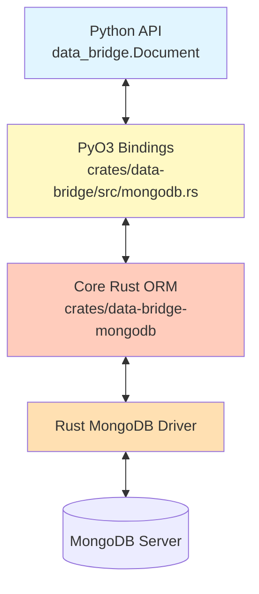

# Core MongoDB Engine Architecture

## Overview

The Core MongoDB Engine is the heart of `data-bridge`, providing a high-performance, safe, and asynchronous interface to MongoDB. It is implemented in pure Rust (`data-bridge-mongodb`) with a PyO3 binding layer (`data-bridge`) that handles the complex bridge between Python objects and BSON data.

**Key Features**:
- **Zero Python Byte Handling**: All BSON serialization/deserialization occurs in Rust.
- **Parallel Processing**: Uses `rayon` and `tokio` to process large batches of documents in parallel.
- **GIL Management**: Minimizes GIL contention by releasing it during heavy computation and I/O.
- **Type Safety**: Enforces type validation at the Rust-Python boundary.
- **Security**: Built-in protection against NoSQL injection.

## Architecture Layers

## Documentation Structure

### 1. [00-architecture.md](./00-architecture.md)
High-level architectural patterns, including:
- Zero-copy deserialization strategy
- **GIL Release Strategy** for high concurrency
- Parallel processing model for batch operations
- Security and validation layers

### 2. [10-components.md](./10-components.md)
Detailed breakdown of key components:
- **Connection Manager**: Pooling and configuration.
- **Document Trait**: The foundation of CRUD operations.
- **Query Builder**: Fluent API for constructing safe queries.
- **BSON Engine**: The conversion logic between Python and BSON.

### 3. [20-data-flows.md](./20-data-flows.md)
Sequence diagrams illustrating:
- **Write Path**: Python Dict → ExtractedValue → BSON → DB
- **Read Path**: DB → BSON → ExtractedValue → Python Object
- **Parallel Batch Operations**: How `insert_many` achieves 3x performance.

### 4. [30-implementation-details.md](./30-implementation-details.md)
Implementation details:
- File structure of `crates/data-bridge-mongodb`
- Key data structures (`RustDocument`, `ExtractedValue`)
- Error handling patterns
- Performance benchmarks

## Success Criteria

- ✅ **Performance**: >2.8x faster inserts than Beanie/PyMongo.
- ✅ **Safety**: Zero safe Rust code causing panics/crashes.
- ✅ **Concurrency**: Linear scaling for batch operations.
- ✅ **Memory**: Minimal Python heap usage during large queries.

## References

- **Pure Rust Crate**: `crates/data-bridge-mongodb/`
- **PyO3 Bindings**: `crates/data-bridge/src/mongodb.rs`
- **Python Layer**: `python/data_bridge/_engine.py`
