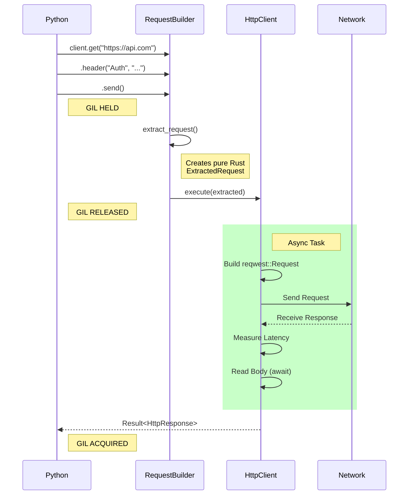
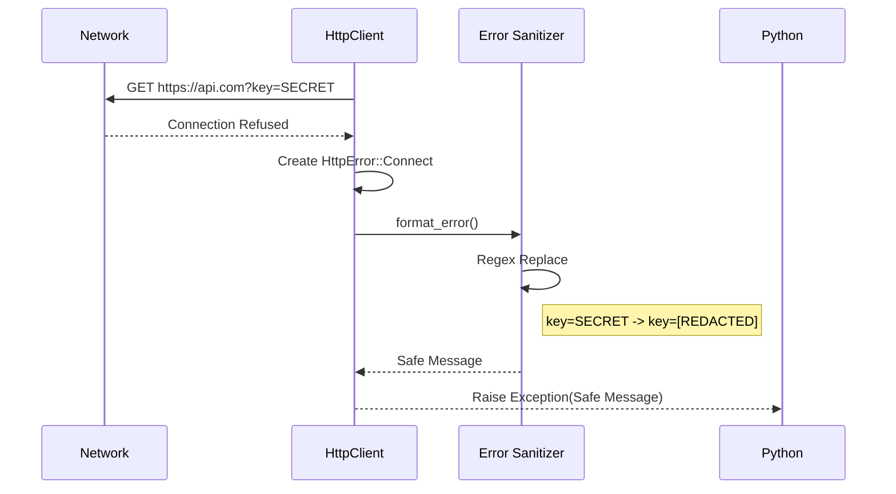

# HTTP Client Data Flows

> Part of [HTTP Client Documentation](./index.md)

## 1. Request Execution Flow

## 2. Error Sanitization Flow

Goal: Ensure a failed request with sensitive data doesn't leak into logs.

