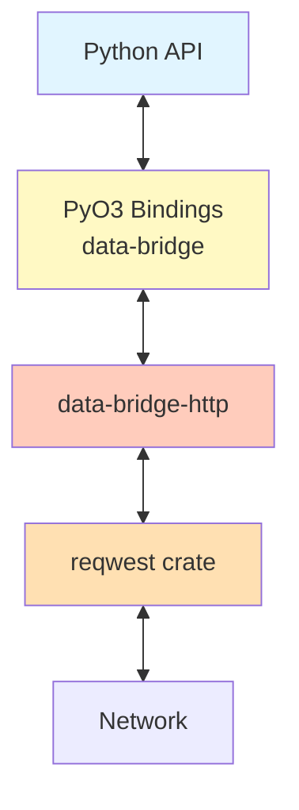

# HTTP Client Architecture

## Overview

The HTTP Client crate (`data-bridge-http`) is a high-performance, asynchronous HTTP client designed for reliability and security. It wraps the robust `reqwest` library, adding specialized features for the `data-bridge` ecosystem such as GIL-aware request processing, error sanitization, and structured latency tracking.

**Key Features**:
- **Async & Parallel**: Built on `tokio` and `reqwest` for non-blocking I/O.
- **GIL Management**: Processes request bodies and headers without holding the Python GIL.
- **Security**: Automatically sanitizes error messages to prevent leaking credentials or internal IPs.
- **Resilience**: Configurable timeouts, connection pooling, and retry policies.
- **Observability**: Tracks latency for every request.

## Architecture Layers

## Documentation Structure

### 1. [00-architecture.md](./00-architecture.md)
High-level design principles:
- The `ExtractedRequest` pattern for thread safety.
- The distinction between Client creation (expensive) and Request execution (cheap).
- Security architecture.

### 2. [10-components.md](./10-components.md)
Detailed breakdown:
- **HttpClient**: The connection pool manager.
- **RequestBuilder**: Fluent API for constructing requests.
- **HttpResponse**: Normalized response structure with latency metrics.
- **Error Sanitizer**: Regex-based redaction engine.

### 3. [20-data-flows.md](./20-data-flows.md)
Sequence diagrams:
- **Request Execution**: Python -> Rust -> Network -> Python.
- **Error Handling**: How raw network errors are sanitized and mapped to exceptions.

### 4. [30-implementation-details.md](./30-implementation-details.md)
Implementation details:
- File structure.
- Key structs (`HttpClientInner`, `ExtractedBody`).
- Configuration options.

## Success Criteria

- ✅ **Performance**: minimal overhead over raw `reqwest`.
- ✅ **Safety**: No sensitive data leaks in error logs.
- ✅ **Concurrency**: Safe to use across multiple threads/tasks.
- ✅ **Usability**: Simple, pythonic API exposed via PyO3.

## References

- **Rust Source**: `crates/data-bridge-http/`
- **Reqwest**: [Documentation](https://docs.rs/reqwest/)
