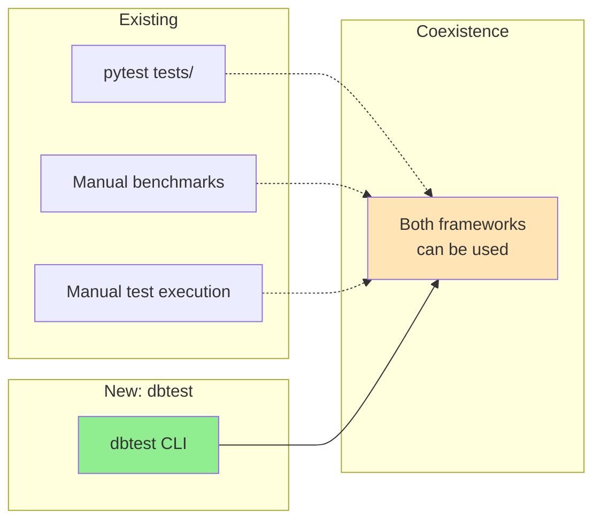
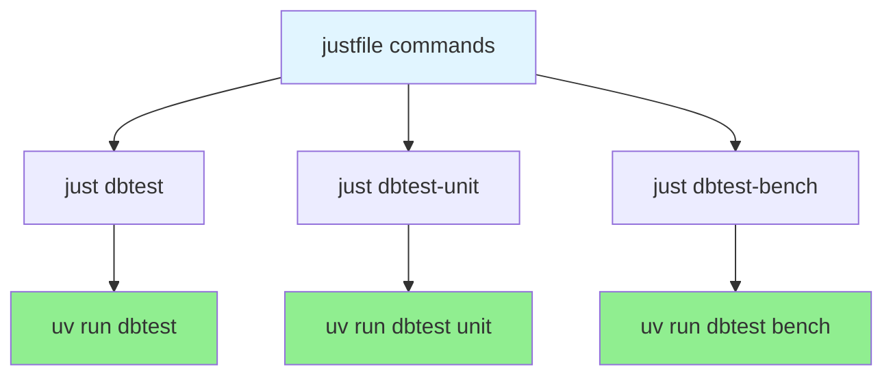

# Components

> Part of [Test Framework Documentation](./index.md)

This document details the responsibilities of each component in the dbtest system.

## Python Layer (Thin Wrapper)

**Role**: Minimal Python wrapper - Rust handles all execution

### 1. CLI (cli.py)

**Purpose**: Command-line interface and argument parsing

**Responsibilities**:
- Parse CLI arguments using argparse
- **Hand off to Rust runner immediately** (Python does NOT orchestrate)
- Display formatted results from Rust to user
- Handle exit codes

**Key Functions**:
```python
def main() -> int:
    """Entry point for dbtest CLI"""

def run_tests_only(config: CliConfig) -> TestReport:
    """Execute tests only (unit + integration)"""

def run_benchmarks_only(config: CliConfig) -> BenchmarkReport:
    """Execute benchmarks only"""

def run_all(config: CliConfig) -> CombinedReport:
    """Execute both tests and benchmarks"""
```

**CLI Arguments**:
- Positional: `{unit,integration,bench}` - Execution mode
- `--pattern PATTERN` - File/test pattern filter
- `--tags TAGS` - Tag filter (comma-separated)
- `--verbose` - Detailed output
- `--fail-fast` - Stop on first failure
- `--format {console,json,markdown}` - Output format

### 2. Lazy Loader (lazy_loader.py)

**Purpose**: On-demand Python module loading (called by Rust)

**Responsibilities**:
- Load Python modules only when **Rust runner** triggers loading
- Use importlib.util for dynamic loading
- Return TestSuite classes or BenchmarkGroup instances
- Handle import errors gracefully
- **Invoked by Rust tasks during parallel execution**

**Key Functions**:
```python
def lazy_load_test_suite(file_path: Path) -> List[Type[TestSuite]]:
    """Load a single test file and return TestSuite classes.

    Called by Rust during test execution phase.
    Uses importlib.util to load module without adding to sys.modules.
    """

def lazy_load_benchmark(file_path: Path) -> List[BenchmarkGroup]:
    """Load a single benchmark file and return registered groups.

    Called by Rust during benchmark execution phase.
    Module execution triggers @decorator and register_group().
    """
```

**Performance**:
- ~10-50ms per module (Python import overhead)
- Only called for files that pass filters
- Deferred until execution phase (not during discovery)

## Rust Layer (Core Engine)

### 3. Discovery (discovery.rs) - NEW

**Purpose**: Fast file discovery and metadata registry

**Responsibilities**:
- Walk file system using walkdir crate (~2ms for 100 files)
- Create FileInfo structs with paths and module names
- Store test/benchmark metadata in registries
- Filter by patterns, tags, and types
- Provide discovery statistics

**Key Types**:
```rust
pub struct DiscoveryConfig {
    pub root_path: PathBuf,
    pub patterns: Vec<String>,    // e.g., ["test_*.py", "bench_*.py"]
    pub exclusions: Vec<String>,  // e.g., ["__pycache__"]
}

pub enum FileType {
    Test,
    Benchmark,
}

pub struct FileInfo {
    pub path: PathBuf,
    pub module_name: String,
    pub file_type: FileType,
}

pub struct TestRegistry {
    files: Vec<FileInfo>,
}

pub struct BenchmarkRegistry {
    files: Vec<FileInfo>,
}

pub struct DiscoveryStats {
    pub files_found: usize,
    pub filtered_count: usize,
    pub discovery_time_ms: u64,
}
```

**Key Functions**:
```rust
pub fn walk_files(config: &DiscoveryConfig) -> Result<Vec<FileInfo>>;
pub fn filter_files(files: Vec<FileInfo>, filters: &Filters) -> Vec<FileInfo>;
pub fn lazy_load_module(py: Python, file_info: &FileInfo) -> PyResult<PyModule>;
```

### 4. Runner (runner.rs) - CORE EXECUTION ENGINE

**Purpose**: Parallel test/benchmark execution with Tokio runtime

**Responsibilities**:
- **Orchestrate parallel execution** - Spawn N concurrent Tokio tasks
- **Manage Tokio runtime** - Control async event loop and task scheduling
- **Schedule tasks** - Distribute tests/benchmarks across available threads
- **Call Python async functions** - Use pyo3-asyncio to bridge Rust ↔ Python async
- **Manage GIL** - Acquire/release GIL per task with `Python::with_gil()`
- **Lazy-load modules** - Trigger Python lazy_loader on-demand
- **Collect results** - Aggregate results from all parallel tasks
- **Handle timeouts and errors** - Per-task error isolation
- **Control resource limits** - Max concurrent tasks, memory limits

**Key Types**:
```rust
pub struct TestRunner {
    runtime: tokio::runtime::Runtime,  // Tokio async runtime
    max_concurrent: usize,              // Max parallel tasks
}

pub struct TestResult {
    pub status: TestStatus,
    pub duration: Duration,
    pub error: Option<String>,
}

pub enum TestStatus {
    Passed,
    Failed,
    Error,
    Skipped,
}

pub struct TaskHandle {
    file_path: PathBuf,
    handle: tokio::task::JoinHandle<TestResult>,
}
```

**Key Functions**:
```rust
/// Parallel test execution (NEW)
pub async fn execute_tests_parallel(
    py: Python<'_>,
    files: Vec<FileInfo>,
    max_concurrent: usize,
) -> Vec<TestResult> {
    let mut handles = vec![];

    for file in files {
        // Spawn parallel task
        let handle = tokio::spawn(async move {
            // Lazy-load Python module
            let module = lazy_load_test_suite(&file.path).await?;

            // Acquire GIL, call Python
            let result = Python::with_gil(|py| {
                call_python_test_function(py, module)
            })?;
            // GIL released automatically

            result
        });
        handles.push(handle);
    }

    // Collect all results concurrently
    let results = futures::future::join_all(handles).await;
    results
}

/// Parallel benchmark execution (NEW)
pub async fn run_benchmarks_parallel(
    py: Python<'_>,
    files: Vec<FileInfo>,
    max_concurrent: usize,
) -> Vec<BenchmarkStats>;

/// Call Python async function from Rust (using pyo3-asyncio)
async fn call_python_test_function(
    py: Python<'_>,
    test_func: PyObject,
) -> PyResult<TestResult>;
```

**Parallel Execution Pattern**:
```rust
// Rust runner spawns N parallel tasks
tokio::spawn(async move {
    // 1. Lazy-load Python module (per task)
    let module = lazy_load_test_suite(file_path).await?;

    // 2. Acquire GIL (minimal contention)
    Python::with_gil(|py| {
        // 3. Call Python async test function
        let result = call_python_test(py, test_func)?;
        result
    }) // GIL released automatically

    // 4. Return result to aggregator
});
```

**Performance Characteristics**:
- **Parallel Scaling**: N tests in ~T/N time (near-linear)
- **Task Overhead**: <1ms per task (Tokio scheduling)
- **GIL Contention**: Minimal (released between Python calls)
- **Concurrent Loading**: All modules load in parallel
- **Resource Control**: Configurable max_concurrent limit

### 5. Reporter (reporter.rs) - EXISTING

**Purpose**: Report generation and formatting

**Responsibilities**:
- Format results in multiple formats (console/JSON/markdown)
- Generate comparison tables for benchmarks
- Save reports to files
- Provide summary statistics

**Key Types** (existing):
```rust
pub struct Reporter {
    format: OutputFormat,
}

pub enum OutputFormat {
    Console,
    Json,
    Markdown,
}

pub struct TestReport {
    pub total: usize,
    pub passed: usize,
    pub failed: usize,
    pub skipped: usize,
    pub errors: usize,
    pub duration: Duration,
}

pub struct BenchmarkReport {
    pub groups: Vec<BenchmarkGroupResult>,
    pub comparisons: Vec<Comparison>,
}
```

**Key Functions**:
```rust
pub fn generate_report(results: &[TestResult]) -> String;
pub fn format_comparison_table(groups: &[BenchmarkGroupResult]) -> String;
```

## PyO3 Bridge Layer

### 6. PyO3 Bindings (test.rs)

**Purpose**: Expose Rust types to Python

**Responsibilities**:
- Wrap Rust types with #[pyclass] macro
- Implement Python methods with #[pymethods]
- Handle Python ↔ Rust type conversions
- Provide thread-safe access with Arc<Mutex<>>

**Key Classes** (to be added):
```rust
#[pyclass(name = "TestRegistry")]
pub struct PyTestRegistry {
    inner: Arc<Mutex<TestRegistry>>,
}

#[pyclass(name = "BenchmarkRegistry")]
pub struct PyBenchmarkRegistry {
    inner: Arc<Mutex<BenchmarkRegistry>>,
}

#[pyclass(name = "FileInfo")]
pub struct PyFileInfo {
    inner: FileInfo,
}

#[pyclass(name = "DiscoveryStats")]
pub struct PyDiscoveryStats {
    inner: DiscoveryStats,
}

#[pymethods]
impl PyTestRegistry {
    #[new]
    fn new() -> Self { ... }

    fn discover(&self, path: String) -> PyResult<PyDiscoveryStats> { ... }

    fn filter_by_pattern(&self, pattern: String) -> PyResult<Vec<PyFileInfo>> { ... }

    fn filter_by_tags(&self, tags: Vec<String>) -> PyResult<Vec<PyFileInfo>> { ... }
}
```

**Thread Safety**:
- All registries wrapped in Arc<Mutex<>> for thread-safe access
- Python GIL released during Rust operations where possible

## Integration Points

### With Existing Systems



**Key Points**:
- `dbtest` is **standalone** - does not interfere with pytest
- Existing test files work with both pytest and dbtest
- BenchmarkGroup pattern is reused from existing framework
- Can run both pytest and dbtest in same project

### With justfile



**justfile Integration**:
```justfile
# Run all tests and benchmarks
dbtest:
    uv run dbtest

# Run unit tests only
dbtest-unit:
    uv run dbtest unit

# Run integration tests only
dbtest-integration:
    uv run dbtest integration

# Run benchmarks only
dbtest-bench:
    uv run dbtest bench

# Run with specific pattern
dbtest-pattern PATTERN:
    uv run dbtest --pattern "{{PATTERN}}"
```

### With Existing Test Framework

**Existing Framework** (`data_bridge.test`):
- TestSuite base class
- @test decorator
- BenchmarkGroup class
- @benchmark decorator
- Assertions (assert_eq, assert_raises, etc.)

**dbtest Integration**:
- **Discovers**: Finds test_*.py and bench_*.py files
- **Loads**: Uses lazy_loader.py to import modules
- **Executes**: Calls TestSuite.run_tests() via Rust runner
- **Reports**: Formats results with Rust reporter

**No Changes Required**: Existing test files work as-is

## Component Communication

### Request Flow (Test Execution)

```
User → CLI → PyO3 → Rust Walker → Rust Registry → Rust Runner (Tokio) → [Parallel Tasks] → Python Lazy Loader → Test Functions → Rust Aggregator → Rust Reporter → CLI → User
```

**Key Flow Changes**:
- Rust Runner controls execution flow (not Python CLI)
- Parallel tasks spawn concurrently via tokio::spawn
- Each task independently: loads module → acquires GIL → calls Python → releases GIL
- Rust aggregates results from all tasks

### Data Flow

```
CLI Args → DiscoveryConfig → Vec<FileInfo> → Filtered FileInfo → Rust Runner → [Tokio Tasks] → Lazy-loaded Modules (parallel) → Test Results (concurrent) → Aggregated Results → Formatted Report
```

**Parallel Data Flow**:
```
FileInfo₁ ─┐
FileInfo₂ ─┼─→ Rust Runner → tokio::spawn(N tasks) ─┬─→ Task₁ → Module₁ → Result₁ ─┐
FileInfo₃ ─┤                                         ├─→ Task₂ → Module₂ → Result₂ ─┼─→ Aggregator → Report
   ...     ─┘                                         └─→ TaskN → ModuleN → ResultN ─┘
```

### Error Propagation

```
Rust Error → PyO3 PyErr → Python Exception → CLI Exit Code
```

## Performance Characteristics

| Component | Operation | Performance | Implementation |
|-----------|-----------|-------------|----------------|
| CLI | Startup | ~200-300ms | Python argparse |
| Discovery | File walk | ~2-3ms (100 files) | Rust walkdir |
| Registry | Filtering | <10ms (1000 files) | Rust string matching |
| **Rust Runner** | **Tokio init** | **~1-2ms** | **Tokio runtime** |
| **Rust Runner** | **Task spawn** | **<1ms per task** | **tokio::spawn** |
| **Rust Runner** | **GIL acquire/release** | **~0.1ms per task** | **Python::with_gil()** |
| **Rust Runner** | **Parallel execution** | **~T/N (N tests)** | **Concurrent tasks** |
| Lazy Loader | Module import | ~10-50ms per file | Python importlib (parallel) |
| **Rust Runner** | **Result aggregation** | **~1-5ms** | **Concurrent collection** |
| Reporter | Formatting | ~10-50ms | Rust templating |

**Sequential Overhead** (excluding test execution): ~250-400ms
**Parallel Execution**: N tests in ~T/N time (near-linear scaling)

**Performance Gains from Rust Runner**:
- ✅ Parallel execution: N tests → ~T/N time
- ✅ Task scheduling: <1ms overhead per task
- ✅ GIL management: Minimal contention
- ✅ Concurrent module loading: All files load in parallel
- ✅ Efficient aggregation: Rust collects results without Python overhead

## See Also

- [Architecture](./00-architecture.md) - High-level architecture
- [State Machines](./40-state-machines.md) - Lifecycle states
- [Data Flows](./20-data-flows.md) - Sequence diagrams
- [Implementation](./30-implementation-details.md) - File structure and patterns
