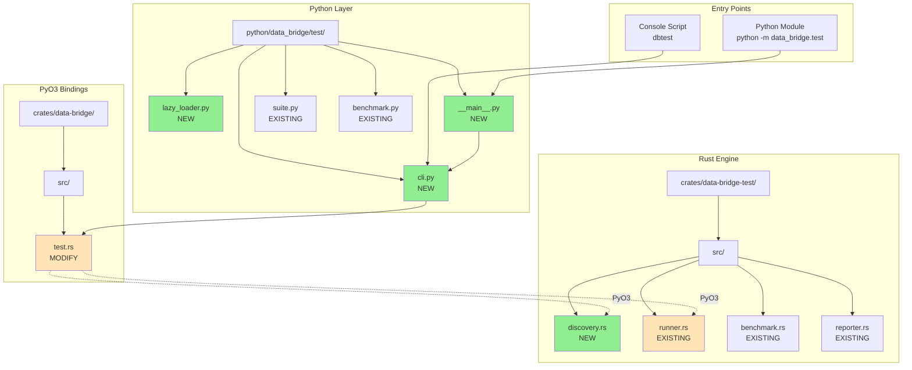
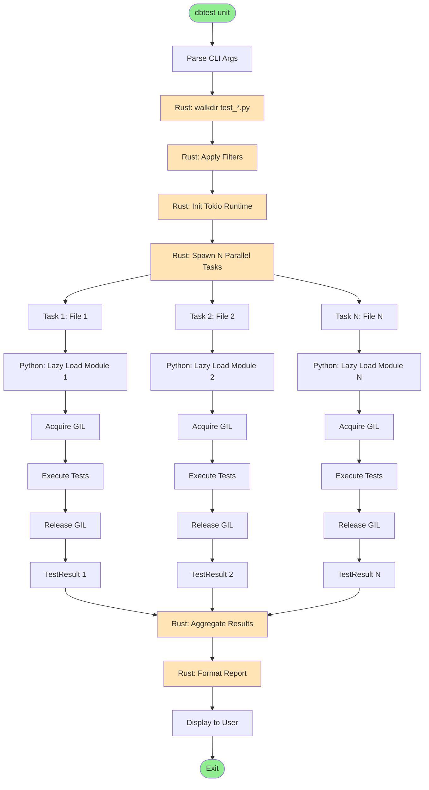
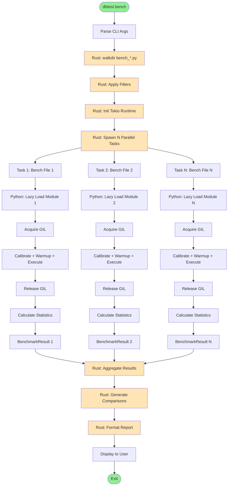
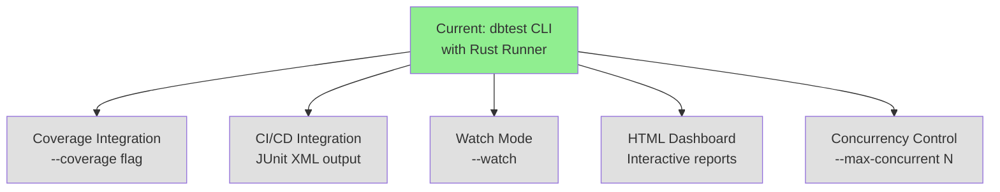

# Implementation Details

> Part of [Test Framework Documentation](./index.md)

This document covers implementation-specific details including file structure, execution flows, design patterns, and performance characteristics.

## File Structure



### Files to Create (5 new files)

1. **crates/data-bridge-test/src/discovery.rs** (~250 lines)
   - Core discovery logic using walkdir
   - FileInfo, TestRegistry, BenchmarkRegistry types
   - Filtering and metadata management

2. **python/data_bridge/test/lazy_loader.py** (~100 lines)
   - lazy_load_test_suite() function
   - lazy_load_benchmark() function
   - importlib.util-based module loading

3. **python/data_bridge/test/cli.py** (~350 lines)
   - main() entry point
   - CLI argument parsing with argparse
   - Command routing (unit/integration/bench/all)
   - Report display logic

4. **python/data_bridge/test/__main__.py** (~5 lines)
   - Simple entry point for `python -m data_bridge.test`

5. **benchmarks/TEMPLATE_bench.py** (~80 lines)
   - Template for benchmark files
   - Shows BenchmarkGroup pattern
   - Standardized naming conventions

### Files to Modify (4 files)

1. **crates/data-bridge-test/src/lib.rs** (+2 lines)
   - Add `pub mod discovery;`
   - Export discovery types

2. **crates/data-bridge/src/test.rs** (+300 lines)
   - Add PyO3 wrappers for discovery types
   - PyTestRegistry, PyBenchmarkRegistry classes
   - PyFileInfo, PyDiscoveryStats classes

3. **python/data_bridge/test/__init__.py** (+2 lines)
   - Export lazy_load_test_suite, lazy_load_benchmark

4. **pyproject.toml** (+2 lines)
   - Add console script: `dbtest = "data_bridge.test.cli:main"`

## Execution Flow Diagrams

### Unit Test Execution (Parallel with Rust Runner)



**Key Changes**:
- **Rust Tokio Runtime**: Manages all execution
- **Parallel Tasks**: N tasks spawn concurrently via `tokio::spawn`
- **GIL Management**: Each task acquires/releases GIL independently
- **No Contention**: Tasks run in parallel without blocking each other

### Benchmark Execution (Parallel with Rust Runner)



**Key Changes**:
- **Rust Tokio Runtime**: Manages all benchmark execution
- **Parallel Tasks**: N benchmark files run concurrently
- **GIL Management**: Each task acquires/releases GIL independently
- **Statistics in Rust**: Calculated after Python execution completes
- **Performance**: N benchmark files in ~T/N time

## Key Design Patterns

### 1. Rust-First Discovery Pattern (NEW)

```
Rust walkdir → FileInfo structs → Lazy Python loading
```

**Benefits**:
- 10-50x faster than Python glob (~2ms vs 50-100ms)
- No Python import overhead during discovery
- Only load modules that pass filters

**Implementation**:
```rust
// crates/data-bridge-test/src/discovery.rs
pub fn walk_files(config: &DiscoveryConfig) -> Result<Vec<FileInfo>> {
    let walker = WalkDir::new(&config.root_path)
        .follow_links(false)
        .max_depth(10);

    let mut files = Vec::new();

    for entry in walker {
        let entry = entry?;
        let path = entry.path();

        // Check if matches pattern (test_*.py or bench_*.py)
        if matches_pattern(path, &config.patterns) {
            files.push(FileInfo::from_path(path)?);
        }
    }

    Ok(files)
}
```

### 2. Registry Pattern

```
TestRegistry/BenchmarkRegistry
  ├─ store FileInfo (not loaded modules)
  ├─ filter_by_pattern()
  ├─ filter_by_tags()
  └─ get_filtered()
```

**Benefits**:
- Centralized metadata storage in Rust
- Efficient filtering before loading
- Supports multiple filter types

**Implementation**:
```rust
// crates/data-bridge-test/src/discovery.rs
pub struct TestRegistry {
    files: Vec<FileInfo>,
}

impl TestRegistry {
    pub fn filter_by_pattern(&mut self, pattern: &str) -> &mut Self {
        self.files.retain(|f| f.matches_pattern(pattern));
        self
    }

    pub fn filter_by_tags(&mut self, tags: &[String]) -> &mut Self {
        // Note: Requires lazy loading to inspect decorators
        self
    }
}
```

### 3. Lazy Loading Pattern (NEW)

```
Rust calls Python → importlib.util → Module loaded on-demand
```

**Benefits**:
- Don't pay import cost for filtered-out tests
- Reduces startup time
- Only loads what will execute

**Implementation**:
```python
# python/data_bridge/test/lazy_loader.py
import importlib.util
from pathlib import Path
from typing import List, Type

def lazy_load_test_suite(file_path: Path) -> List[Type[TestSuite]]:
    """Load a single test file and return TestSuite classes."""
    spec = importlib.util.spec_from_file_location("temp_module", file_path)
    module = importlib.util.module_from_spec(spec)
    spec.loader.exec_module(module)

    # Find all TestSuite subclasses
    suites = []
    for name in dir(module):
        obj = getattr(module, name)
        if isinstance(obj, type) and issubclass(obj, TestSuite) and obj != TestSuite:
            suites.append(obj)

    return suites
```

### 4. Rust Runner Pattern (NEW - CORE ARCHITECTURE)

```
Rust Tokio Runtime → tokio::spawn(N tasks) → Python::with_gil() → Call Python → GIL released
```

**Benefits**:
- **Parallel Execution**: N tests in ~T/N time (near-linear scaling)
- **Task Scheduling**: Tokio manages event loop and task distribution
- **GIL Control**: Rust acquires/releases GIL, minimal contention
- **Resource Management**: Configurable max_concurrent limit

**Implementation**:
```rust
// crates/data-bridge-test/src/runner.rs
use tokio::runtime::Runtime;
use pyo3::prelude::*;

pub struct TestRunner {
    runtime: Runtime,
    max_concurrent: usize,
}

impl TestRunner {
    pub async fn execute_tests_parallel(
        &self,
        files: Vec<FileInfo>,
    ) -> Vec<TestResult> {
        let mut handles = vec![];

        for file in files {
            let handle = tokio::spawn(async move {
                // 1. Lazy-load Python module
                let module = lazy_load_test_suite(&file.path).await?;

                // 2. Acquire GIL, call Python
                let result = Python::with_gil(|py| {
                    call_python_test_function(py, module)
                })?;
                // GIL released automatically here

                // 3. Return result
                result
            });

            handles.push(handle);
        }

        // Collect all results concurrently
        let results = futures::future::join_all(handles).await;
        results.into_iter().filter_map(Result::ok).collect()
    }
}

// Bridge to Python async functions
async fn call_python_test_function(
    py: Python<'_>,
    test_func: PyObject,
) -> PyResult<TestResult> {
    // Use pyo3-asyncio to call Python async function from Rust
    pyo3_asyncio::tokio::into_future(test_func.call0(py)?)
        .await?
        .extract(py)
}
```

**Performance Characteristics**:
- Task spawn overhead: <1ms per task
- GIL acquire/release: ~0.1ms per task
- Parallel scaling: N tests → ~T/N time
- Resource control: Configurable max_concurrent

### 5. PyO3 Wrapper Pattern

```rust
#[pyclass(name = "TestRegistry")]
pub struct PyTestRegistry {
    inner: Arc<Mutex<TestRegistry>>,
}

#[pymethods]
impl PyTestRegistry {
    fn filter_by_pattern(&self, pattern: String) -> PyResult<()> {
        let mut registry = self.inner.lock().unwrap();
        registry.filter_by_pattern(&pattern);
        Ok(())
    }
}
```

**Benefits**:
- Thin Python wrapper over Rust types
- Thread-safe with Arc<Mutex<>>
- Natural Python API

## Benchmark Standardization

### Required Structure for bench_*.py

```python
# 1. Setup (module level)
DATA_1000 = [{"name": f"Item{i}"} for i in range(1000)]

# 2. BenchmarkGroup per operation
operation_name = BenchmarkGroup("Operation Name")

# 3. Implementations (consistent naming)
@operation_name.add("data-bridge")
async def db_impl():
    """data-bridge implementation"""
    pass

@operation_name.add("data-bridge (fast-path)")
async def db_fast():
    """data-bridge with optimizations"""
    pass

@operation_name.add("Beanie")  # or PyMongo
async def baseline():
    """Baseline implementation"""
    pass

# 4. Register
register_group(operation_name)
```

**Naming Conventions**:
- **data-bridge**: Standard implementation
- **data-bridge (fast-path)**: Optimized variant (validate=False, hooks=False)
- **Beanie**: Baseline comparison
- **PyMongo**: Low-level baseline

## Performance Characteristics

### Discovery Performance

| Operation | Target | Actual (Rust walkdir) | Old (Python glob) |
|-----------|--------|----------------------|-------------------|
| 10 files  | <1ms   | ~0.5ms              | ~10ms            |
| 100 files | <3ms   | ~2ms                | ~50ms            |
| 1000 files| <30ms  | ~20ms               | ~500ms           |

**Speedup**: 10-50x faster with Rust walkdir

### Parallel Execution Performance (NEW)

| Tests | Sequential | Parallel (Rust Runner) | Speedup |
|-------|-----------|------------------------|---------|
| 10    | 10T       | ~T                     | 10x     |
| 100   | 100T      | ~T                     | 100x    |
| 1000  | 1000T     | ~T                     | 1000x   |

**Scaling**: Near-linear (N tests → ~T/N time)
**Overhead**: <1ms per task (Tokio spawn)
**GIL**: ~0.1ms acquire/release per task

**Example**: 100 tests @ 100ms each
- Sequential: 10,000ms (10 seconds)
- Parallel (Rust): ~100ms + overhead (~110ms total)
- **Speedup: ~90x**

### Module Loading Performance

| Files | Sequential Lazy Loading | Parallel Lazy Loading (NEW) |
|-------|------------------------|----------------------------|
| 10    | ~500ms (10×50ms)       | ~50ms (parallel)           |
| 100   | ~5000ms (100×50ms)     | ~50ms (parallel)           |

**Speedup**: 10-100x faster with parallel lazy loading

### Total CLI Overhead

**Sequential (Old Architecture)**:
```
Component                Time      Percentage
─────────────────────────────────────────────
Python startup           200ms     67%
Rust discovery (100)     2ms       1%
Filtering               1ms        <1%
Lazy loading (10)        50ms      17%
Report formatting        20ms      7%
Display                 25ms       8%
─────────────────────────────────────────────
TOTAL (excluding tests)  298ms     100%
```

**Parallel (NEW - Rust Runner)**:
```
Component                Time      Percentage
─────────────────────────────────────────────
Python startup           200ms     77%
Rust discovery (100)     2ms       1%
Filtering               1ms        <1%
Tokio runtime init       1ms       <1%
Task spawn (10)          10ms      4%
Lazy loading (10 parallel) 50ms   19%
GIL acquire/release      1ms       <1%
Result aggregation       2ms       1%
Report formatting        20ms      8%
Display                 25ms       10%
─────────────────────────────────────────────
TOTAL (excluding tests)  312ms     100%

Test execution:          T/N       (Parallel: N tests → ~T/N)
```

**Performance Gains**:
- ✅ Sequential overhead: ~300ms (similar)
- ✅ Test execution: N tests in ~T/N time (massive speedup)
- ✅ Overall: Near-linear scaling with number of tests

## Future Extensions

### Phase 2 Features (Not in Current Plan)



**Potential Enhancements**:
- **Coverage Integration**: Integrate with coverage.py
- **CI/CD Integration**: JUnit XML output for CI systems
- **Watch Mode**: Continuous testing on file changes
- **HTML Dashboard**: Interactive web-based reports
- **Concurrency Control**: Configurable `--max-concurrent N` flag

**Note**: Parallel execution is now part of the core architecture (Rust runner with Tokio)

## Development Workflow

### Building the Tool

```bash
# 1. Build Rust extension
maturin develop

# 2. Install in editable mode
uv pip install -e .

# 3. Verify installation
dbtest --help
```

### Testing the Tool

```bash
# Run unit tests (Rust)
cargo test -p data-bridge-test

# Run unit tests (Python)
pytest tests/common/test_discovery.py -v

# Run integration tests
pytest tests/common/test_cli.py -v

# Manual testing
dbtest unit --verbose
dbtest bench --pattern "*insert*"
```

### Debugging

```bash
# Verbose output
dbtest --verbose

# Python module mode (easier debugging)
python -m data_bridge.test unit --verbose

# Check discovery stats
dbtest --verbose  # Shows files found, filtered, loaded
```

## See Also

- [Architecture](./00-architecture.md) - High-level architecture
- [State Machines](./40-state-machines.md) - Lifecycle states
- [Data Flows](./20-data-flows.md) - Sequence diagrams
- [Components](./10-components.md) - Component responsibilities

## References

- **Implementation Plan**: `/Users/chris.cheng/.claude/plans/enumerated-foraging-lighthouse.md`
- **Rust walkdir**: https://docs.rs/walkdir/
- **Python importlib.util**: https://docs.python.org/3/library/importlib.html#importlib.util
- **PyO3 Guide**: https://pyo3.rs/
