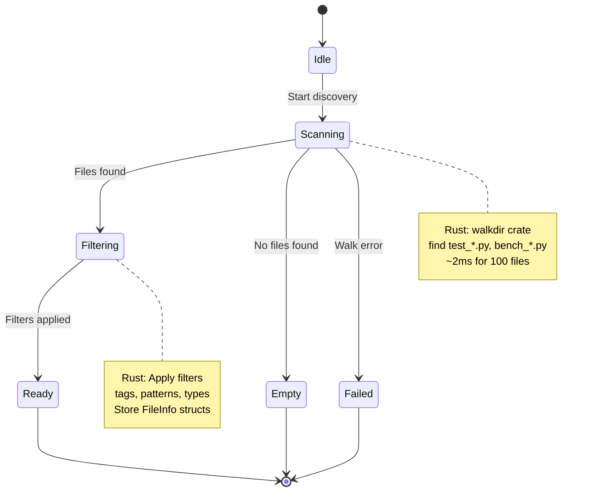
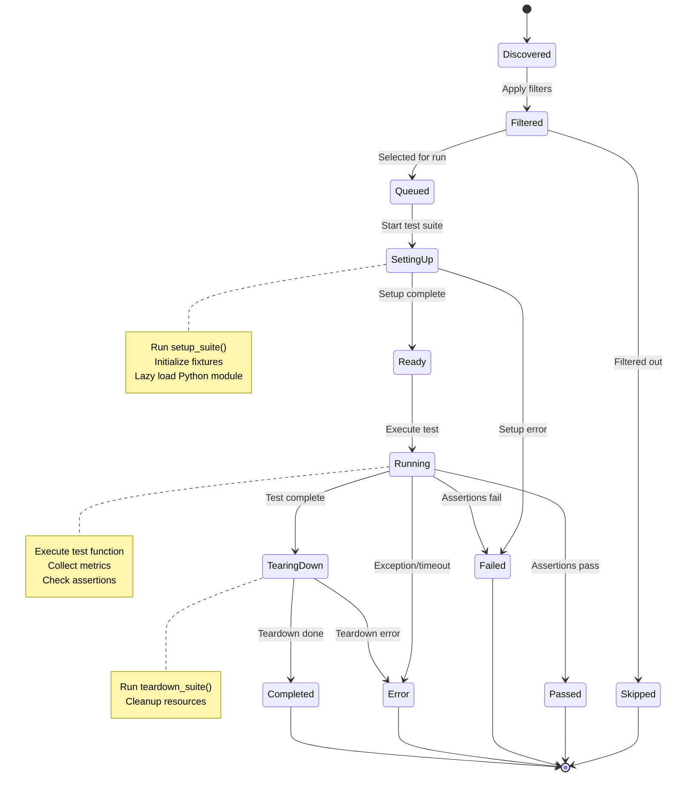
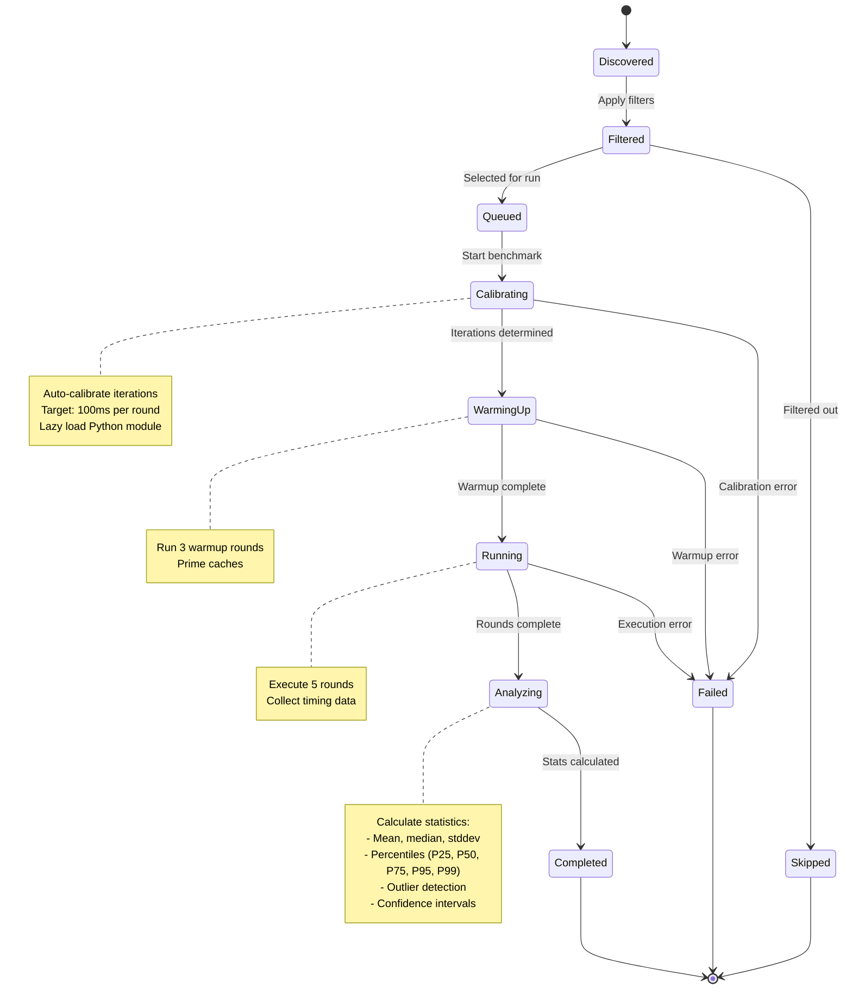
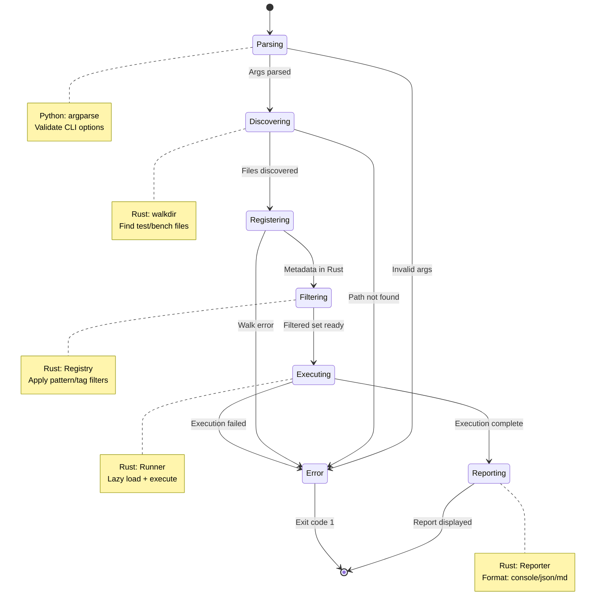

# State Machines

> Part of [Test Framework Documentation](./index.md)

This document defines the state machines for the dbtest system, including discovery, test execution, benchmark execution, and CLI workflows.

## Discovery State Machine



**States**:
- **Idle**: Initial state, no discovery started
- **Scanning**: Rust walkdir traversing file system
- **Filtering**: Applying pattern/tag filters in Rust
- **Ready**: FileInfo list ready for lazy loading
- **Empty**: No matching files found
- **Failed**: File system error during walk

## Test Execution State Machine



**States**:
- **Discovered**: Test found during file discovery (Rust)
- **Filtered**: After tag/pattern filtering (Rust)
- **Queued**: Scheduled for execution
- **SettingUp**: Running setup_suite() (Python module loaded here)
- **Ready**: Setup complete, ready to run test
- **Running**: Test function executing
- **TearingDown**: Running teardown_suite()
- **Completed**: All phases done
- **Passed/Failed/Error/Skipped**: Final states (TestStatus)

## Benchmark Execution State Machine



**States**:
- **Discovered**: Benchmark found during file discovery (Rust)
- **Filtered**: After pattern filtering (Rust)
- **Queued**: Scheduled for execution
- **Calibrating**: Determining iteration count (Python module loaded here)
- **WarmingUp**: Running warmup rounds
- **Running**: Executing timed rounds
- **Analyzing**: Computing statistics
- **Completed**: All phases done, stats ready
- **Skipped/Failed**: Terminal states

## CLI Execution State Machine



**States**:
- **Parsing**: CLI argument parsing (Python)
- **Discovering**: File discovery (Rust walkdir)
- **Registering**: Creating FileInfo structs (Rust)
- **Filtering**: Applying filters (Rust)
- **Executing**: Running tests/benchmarks (Rust + lazy Python loading)
- **Reporting**: Generating and displaying report (Rust)
- **Error**: Any error occurred, will exit with code 1

## State Transitions & Triggers

### Test Lifecycle Transitions

| From State | Trigger | To State | Action |
|------------|---------|----------|--------|
| Discovered | Filter match | Filtered | Add to filtered set |
| Discovered | Filter mismatch | Skipped | Mark as skipped |
| Filtered | Execution start | Queued | Add to execution queue |
| Queued | Runner picks up | SettingUp | Lazy load module, call setup_suite() |
| SettingUp | Setup succeeds | Ready | Mark ready |
| SettingUp | Setup fails | Failed | Record error |
| Ready | Test starts | Running | Execute test function |
| Running | All assertions pass | Passed | Record success |
| Running | Assertion fails | Failed | Record failure |
| Running | Exception raised | Error | Record error |
| Running | Timeout | Error | Record timeout |
| Passed/Failed/Error | Cleanup needed | TearingDown | Call teardown_suite() |
| TearingDown | Teardown succeeds | Completed | Finalize |
| TearingDown | Teardown fails | Error | Record teardown error |

### Benchmark Lifecycle Transitions

| From State | Trigger | To State | Action |
|------------|---------|----------|--------|
| Discovered | Filter match | Filtered | Add to filtered set |
| Discovered | Filter mismatch | Skipped | Mark as skipped |
| Filtered | Execution start | Queued | Add to execution queue |
| Queued | Runner picks up | Calibrating | Lazy load module, determine iterations |
| Calibrating | Iterations found | WarmingUp | Run warmup rounds |
| Calibrating | Calibration fails | Failed | Record error |
| WarmingUp | Warmup done | Running | Run timed rounds |
| WarmingUp | Warmup fails | Failed | Record error |
| Running | All rounds done | Analyzing | Calculate statistics |
| Running | Round fails | Failed | Record error |
| Analyzing | Stats computed | Completed | Finalize results |

## State Data Structures (Rust)

### Overall Execution State

```rust
/// Overall execution state
#[derive(Debug, Clone, PartialEq, Eq)]
pub enum ExecutionState {
    Idle,
    Discovering,
    Filtering,
    Executing,
    Reporting,
    Completed,
    Failed(String),
}
```

### Test Lifecycle State

```rust
/// Test lifecycle state
#[derive(Debug, Clone, PartialEq, Eq)]
pub enum TestLifecycleState {
    Discovered,
    Filtered,
    Queued,
    SettingUp,
    Ready,
    Running,
    TearingDown,
    Completed(TestStatus),  // Passed/Failed/Error/Skipped
}
```

### Benchmark Lifecycle State

```rust
/// Benchmark lifecycle state
#[derive(Debug, Clone, PartialEq, Eq)]
pub enum BenchmarkLifecycleState {
    Discovered,
    Filtered,
    Queued,
    Calibrating,
    WarmingUp,
    Running { current_round: usize, total_rounds: usize },
    Analyzing,
    Completed,
    Failed(String),
}
```

### Test Status (Final Outcome)

```rust
/// Test status (final outcome) - EXISTING in runner.rs
#[derive(Debug, Clone, Copy, PartialEq, Eq)]
pub enum TestStatus {
    Passed,
    Failed,
    Skipped,
    Error,
}
```

### State Tracking

```rust
/// Tracks test execution state
pub struct TestExecution {
    meta: TestMeta,
    state: TestLifecycleState,
    started_at: Option<Instant>,
    completed_at: Option<Instant>,
    result: Option<TestResult>,
}

/// Tracks benchmark execution state
pub struct BenchmarkExecution {
    meta: BenchmarkMeta,
    state: BenchmarkLifecycleState,
    calibration_iterations: Option<usize>,
    warmup_results: Vec<Duration>,
    round_results: Vec<Duration>,
    stats: Option<BenchmarkStats>,
}
```

## State Persistence

**In-Memory Only**:
- States are tracked during execution in Rust
- No persistence to disk
- State machine resets on each CLI invocation

**Rationale**:
- Simplicity: No cache invalidation issues
- Performance: <3ms discovery is fast enough to repeat
- Reliability: Always fresh, no stale state

## See Also

- [Architecture](./00-architecture.md) - System architecture diagrams
- [Data Flows](./20-data-flows.md) - Sequence diagrams
- [Implementation](./30-implementation-details.md) - File structure and patterns
