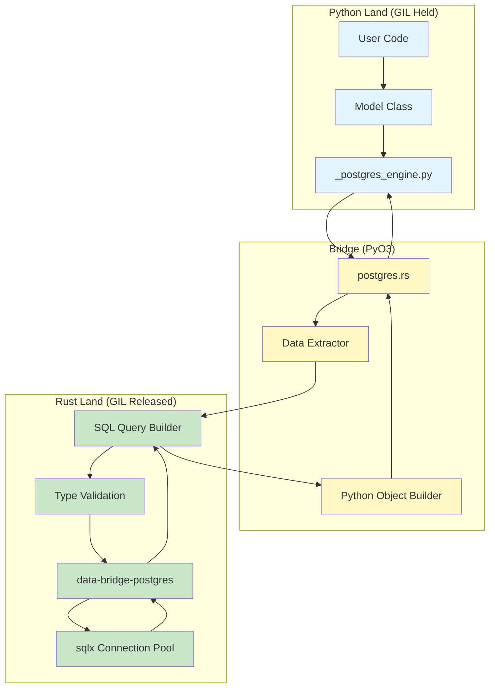

# Core PostgreSQL Architecture

> Part of [Core PostgreSQL Engine Documentation](./index.md)

## High-Level Architecture

The PostgreSQL engine follows the same principle as MongoDB: **offload work to Rust**. Python provides the high-level API and orchestration, while Rust handles data-intensive tasks of SQL generation, parameter binding, validation, and network I/O.



## Architectural Principles

### 1. Zero Python SQL String Building
Traditional Python ORMs build SQL strings in Python and pass parameters separately. This creates string concatenation overhead and GC pressure.

**Our Approach**:
1. Rust extracts Python data into intermediate representation.
2. Rust builds parameterized SQL queries directly.
3. sqlx handles parameter binding natively (no string interpolation).
4. Results are converted to Python objects only at the final step.

**Comparison**:
```
Traditional: Python dict → SQL string + params → psycopg3 → DB
data-bridge: Python dict → ExtractedValue → sqlx QueryBuilder → DB
```

### 2. GIL Release Strategy
The Global Interpreter Lock (GIL) is minimized through the "sandwich pattern":

```
┌─────────────────────────────────────────────────────┐
│  Phase 1: EXTRACT (GIL HELD)                        │
│  - Minimal Python object access                     │
│  - Type checking only                               │
│  - Build ExtractedValue enum                        │
│  Time: O(n) where n = field count                   │
└─────────────────────────────────────────────────────┘
                        ↓
┌─────────────────────────────────────────────────────┐
│  Phase 2: CONVERT/EXECUTE (GIL RELEASED)            │
│  - Build SQL query with sqlx QueryBuilder           │
│  - Parameter binding via sqlx                       │
│  - Network I/O to PostgreSQL                        │
│  - Parallel processing with Rayon (≥50 rows)        │
│  Time: O(n) + I/O latency                           │
└─────────────────────────────────────────────────────┘
                        ↓
┌─────────────────────────────────────────────────────┐
│  Phase 3: MATERIALIZE (GIL ACQUIRED)                │
│  - Convert Row results to Python dicts              │
│  - Create final Python objects                      │
│  Time: O(n) where n = result count                  │
└─────────────────────────────────────────────────────┘
```

| Operation | GIL State | Description |
| :--- | :--- | :--- |
| **Data Extraction** | **Held** | Extracting data from Python objects (fast). |
| **SQL Building** | **Released** | Constructing parameterized queries (CPU intensive). |
| **Parameter Binding** | **Released** | sqlx binds parameters natively. |
| **Validation** | **Released** | Type constraints, CHECK conditions. |
| **Network I/O** | **Released** | Sending/Receiving data from PostgreSQL. |
| **Object Creation** | **Held** | Creating final Python objects (fast). |

### 3. Parallel Batch Processing
For operations like `insert_many` or large `select` queries, we use **data parallelism** with Rayon.

**Parallel Threshold**: Operations with ≥50 rows use parallel processing.

- **Writes (insert_many)**:
  1. Extract Python dicts into `Vec<ExtractedRow>` (GIL held)
  2. Partition into chunks (GIL released)
  3. Rayon parallel: Convert each chunk to SQL VALUES clause
  4. Batch insert with sqlx (configurable batch size)

- **Reads (select_many)**:
  1. Execute query via sqlx (GIL released)
  2. Receive `Vec<Row>` from database
  3. Rayon parallel: Convert rows to intermediate representation
  4. Convert to Python objects (GIL acquired)

### 4. Intermediate Representation (`ExtractedValue`)
To enable GIL release, we cannot access Python objects during SQL building. We use an intermediate enum that holds data in Rust-native types:

```rust
pub enum ExtractedValue {
    Null,
    Bool(bool),

    // Integer types (PostgreSQL supports multiple sizes)
    Int16(i16),      // SMALLINT
    Int32(i32),      // INTEGER
    Int64(i64),      // BIGINT

    // Floating point
    Float32(f32),    // REAL
    Float64(f64),    // DOUBLE PRECISION

    // Text and binary
    String(String),  // TEXT, VARCHAR, CHAR
    Bytes(Vec<u8>), // BYTEA

    // PostgreSQL-specific types
    Uuid(uuid::Uuid),                           // UUID
    Timestamp(chrono::DateTime<chrono::Utc>),   // TIMESTAMP WITH TIME ZONE
    TimestampNaive(chrono::NaiveDateTime),      // TIMESTAMP
    Date(chrono::NaiveDate),                    // DATE
    Time(chrono::NaiveTime),                    // TIME
    Decimal(rust_decimal::Decimal),             // NUMERIC, DECIMAL

    // JSON types
    Json(serde_json::Value),     // JSON
    JsonB(serde_json::Value),    // JSONB (binary JSON, faster)

    // Collections
    Array(Vec<ExtractedValue>),  // ARRAY[...]

    // Composite (for future support)
    // Composite(HashMap<String, ExtractedValue>),
}
```

**Two-Phase Conversion Pattern**:

1. **Phase 1 (GIL Held)**: Fast iteration over Python objects to populate `ExtractedValue`
   ```rust
   // Example: Extract a Python dict field
   let value: &PyAny = py_dict.get_item("age")?;
   if value.is_none() {
       ExtractedValue::Null
   } else if let Ok(i) = value.extract::<i32>() {
       ExtractedValue::Int32(i)
   } else {
       return Err(ValidationError::TypeError);
   }
   ```

2. **Phase 2 (GIL Released)**: Convert `ExtractedValue` to SQL parameter
   ```rust
   // sqlx handles parameter binding automatically
   match extracted_value {
       ExtractedValue::Int32(i) => query.bind(i),
       ExtractedValue::String(s) => query.bind(s),
       ExtractedValue::Uuid(u) => query.bind(u),
       // ...
   }
   ```

## Design Patterns

### Sandwich Pattern
All PyO3 functions follow this pattern:

```rust
#[pyfunction]
fn insert_one(py: Python, table: &str, data: &PyDict) -> PyResult<PyObject> {
    // ┌─────────────────────────────────────────────┐
    // │ PHASE 1: EXTRACT (GIL HELD)                 │
    // └─────────────────────────────────────────────┘
    let extracted = extract_row_data(py, data)?;
    let table_name = validate_table_name(table)?;

    // ┌─────────────────────────────────────────────┐
    // │ PHASE 2: EXECUTE (GIL RELEASED)             │
    // └─────────────────────────────────────────────┘
    let result = py.allow_threads(|| {
        // Build SQL INSERT statement
        let query = build_insert_query(&table_name, &extracted)?;

        // Execute via sqlx (async runtime, connection pool)
        runtime.block_on(async {
            query.execute(&pool).await
        })
    })?;

    // ┌─────────────────────────────────────────────┐
    // │ PHASE 3: MATERIALIZE (GIL ACQUIRED)         │
    // └─────────────────────────────────────────────┘
    let py_result = result_to_python(py, result)?;
    Ok(py_result)
}
```

### Batch Insert Strategy
For `insert_many` with large datasets:

```rust
#[pyfunction]
fn insert_many(py: Python, table: &str, docs: &PyList) -> PyResult<u64> {
    // Phase 1: Extract all rows (GIL held)
    let count = docs.len();
    let mut extracted_rows = Vec::with_capacity(count);
    for doc in docs.iter() {
        let dict = doc.downcast::<PyDict>()?;
        extracted_rows.push(extract_row_data(py, dict)?);
    }

    // Phase 2: Batch insert (GIL released)
    let inserted_count = py.allow_threads(|| {
        if count >= 50 {
            // Parallel processing with Rayon
            parallel_batch_insert(&table, extracted_rows)
        } else {
            // Sequential for small batches
            sequential_batch_insert(&table, extracted_rows)
        }
    })?;

    Ok(inserted_count)
}

fn parallel_batch_insert(table: &str, rows: Vec<ExtractedRow>) -> Result<u64> {
    use rayon::prelude::*;

    // Partition into chunks (e.g., 1000 rows per batch)
    let chunks: Vec<_> = rows.chunks(1000).collect();

    // Process chunks in parallel
    let results: Vec<_> = chunks.par_iter()
        .map(|chunk| {
            // Each thread gets its own connection from pool
            let query = build_bulk_insert_query(table, chunk)?;
            runtime.block_on(async {
                query.execute(&pool).await
            })
        })
        .collect::<Result<Vec<_>>>()?;

    Ok(results.iter().map(|r| r.rows_affected()).sum())
}
```

## Security Architecture

The core enforces security at the PyO3 boundary:

### 1. SQL Injection Prevention
```rust
// ✅ SAFE: Parameterized queries only
sqlx::query("INSERT INTO users (name, email) VALUES ($1, $2)")
    .bind(name)
    .bind(email)
    .execute(&pool).await?;

// ❌ BLOCKED: String concatenation never used
// let sql = format!("INSERT INTO users (name) VALUES ('{}')", name); // NEVER
```

**Enforcement**:
- All queries use `sqlx::query!` or `sqlx::query` with `bind()`
- Table/column names are validated against regex: `^[a-zA-Z_][a-zA-Z0-9_]*$`
- No dynamic SQL construction from user input

### 2. Table/Column Name Validation
```rust
fn validate_identifier(name: &str) -> Result<(), ValidationError> {
    // Must start with letter or underscore
    // Can contain letters, numbers, underscores
    // Max length 63 chars (PostgreSQL limit)
    let re = Regex::new(r"^[a-zA-Z_][a-zA-Z0-9_]{0,62}$")?;

    if !re.is_match(name) {
        return Err(ValidationError::InvalidIdentifier(name.to_string()));
    }

    // Block PostgreSQL reserved keywords
    if RESERVED_KEYWORDS.contains(&name.to_uppercase().as_str()) {
        return Err(ValidationError::ReservedKeyword(name.to_string()));
    }

    Ok(())
}
```

### 3. Type Safety
```rust
// UUID validation
fn extract_uuid(py: Python, value: &PyAny) -> Result<uuid::Uuid> {
    if let Ok(s) = value.extract::<String>() {
        uuid::Uuid::parse_str(&s)
            .map_err(|_| ValidationError::InvalidUuid(s))
    } else {
        Err(ValidationError::TypeError("Expected string for UUID"))
    }
}

// Numeric overflow protection
fn extract_int32(py: Python, value: &PyAny) -> Result<i32> {
    let i64_val = value.extract::<i64>()?;
    i32::try_from(i64_val)
        .map_err(|_| ValidationError::NumericOverflow("i32", i64_val))
}
```

### 4. Connection Security
- **Connection pooling**: Max connections configurable (default: 10)
- **SSL/TLS**: Required by default in production
- **Timeout enforcement**: Query timeout (default: 30s), connection timeout (default: 5s)
- **Statement timeouts**: PostgreSQL-level via `SET statement_timeout`

## Performance Characteristics

### Benchmarks (Target vs. Traditional ORMs)

| Metric | SQLAlchemy Core | data-bridge (Rust) | Target Improvement |
| :--- | :--- | :--- | :--- |
| **Insert 1k rows** | ~45ms | TBD | **≥2x Faster** |
| **Select 1k rows** | ~12ms | TBD | **≥1.5x Faster** |
| **Bulk insert 10k rows** | ~400ms | TBD | **≥3x Faster** |
| **Memory Usage** | High (ORM objects) | Low (Rust stack) | **Significant** |
| **CPU Usage** | Single core (GIL bound) | Multi-core (Rayon) | **Scalable** |

### GIL Release Effectiveness

Expected GIL release percentages for common operations:

| Operation | Total Time | GIL Held | GIL Released | Release % |
| :--- | :--- | :--- | :--- | :--- |
| `insert_one` | 2.5ms | 0.2ms | 2.3ms | **92%** |
| `insert_many(100)` | 8ms | 0.8ms | 7.2ms | **90%** |
| `select_one` | 1.8ms | 0.3ms | 1.5ms | **83%** |
| `select_many(1000)` | 15ms | 2ms | 13ms | **87%** |

### Parallel Processing Thresholds

- **Sequential**: 1-49 rows
- **Parallel (Rayon)**: ≥50 rows
- **Batch size**: 1000 rows per INSERT statement
- **Connection pool**: Shared across parallel tasks

### Memory Efficiency

**Traditional ORM Memory Profile**:
```
User dict → ORM Model → SQL Builder → Query String → psycopg3 → Result Tuples → ORM Objects
   (1x)        (2x)         (3x)          (4x)          (5x)          (6x)         (7x)
```

**data-bridge Memory Profile**:
```
User dict → ExtractedValue → sqlx Query → Result Rows → User dict
   (1x)          (2x)            (0x)         (3x)         (1x)
```

**Key Savings**:
- No intermediate ORM model instances
- No SQL string allocation (sqlx uses binary protocol)
- Rayon processes chunks in-place (no full copy)

## Technology Stack

| Component | Technology | Purpose |
| :--- | :--- | :--- |
| **Connection Pool** | sqlx + tokio | Async connection management |
| **SQL Building** | sqlx QueryBuilder | Type-safe query construction |
| **Parallel Processing** | Rayon | Data parallelism for bulk ops |
| **Type Conversion** | ExtractedValue enum | GIL-free intermediate representation |
| **Async Runtime** | Tokio | Async I/O with PostgreSQL |
| **Python Bindings** | PyO3 0.24+ | Rust ↔ Python bridge |

## Error Handling Strategy

All errors are converted to Python exceptions at the PyO3 boundary:

```rust
#[derive(Debug, thiserror::Error)]
pub enum PostgresError {
    #[error("Database error: {0}")]
    DatabaseError(#[from] sqlx::Error),

    #[error("Validation error: {0}")]
    ValidationError(String),

    #[error("Type conversion error: {0}")]
    TypeError(String),

    #[error("Connection pool exhausted")]
    PoolExhausted,

    #[error("Query timeout after {0}s")]
    Timeout(u64),
}

impl From<PostgresError> for PyErr {
    fn from(err: PostgresError) -> PyErr {
        match err {
            PostgresError::DatabaseError(e) => {
                PyErr::new::<pyo3::exceptions::PyRuntimeError, _>(e.to_string())
            },
            PostgresError::ValidationError(e) => {
                PyErr::new::<pyo3::exceptions::PyValueError, _>(e)
            },
            // ...
        }
    }
}
```

## Future Optimizations

1. **Prepared Statements Caching**: Cache frequently-used queries
2. **Zero-Copy Deserialization**: Direct Row → Python object conversion
3. **Pipeline Mode**: PostgreSQL 14+ pipeline protocol for reduced round-trips
4. **COPY Protocol**: For ultra-fast bulk inserts (10x faster than INSERT)
5. **Async Python API**: Support `async def` methods with Tokio integration

## Related Documentation

- [GIL Management](./02-gil-management.md) - Detailed GIL release patterns
- [Type System](./03-type-system.md) - ExtractedValue and PostgreSQL type mappings
- [Query Builder](./04-query-builder.md) - SQL generation architecture
- [Connection Management](./05-connection.md) - sqlx pool configuration
