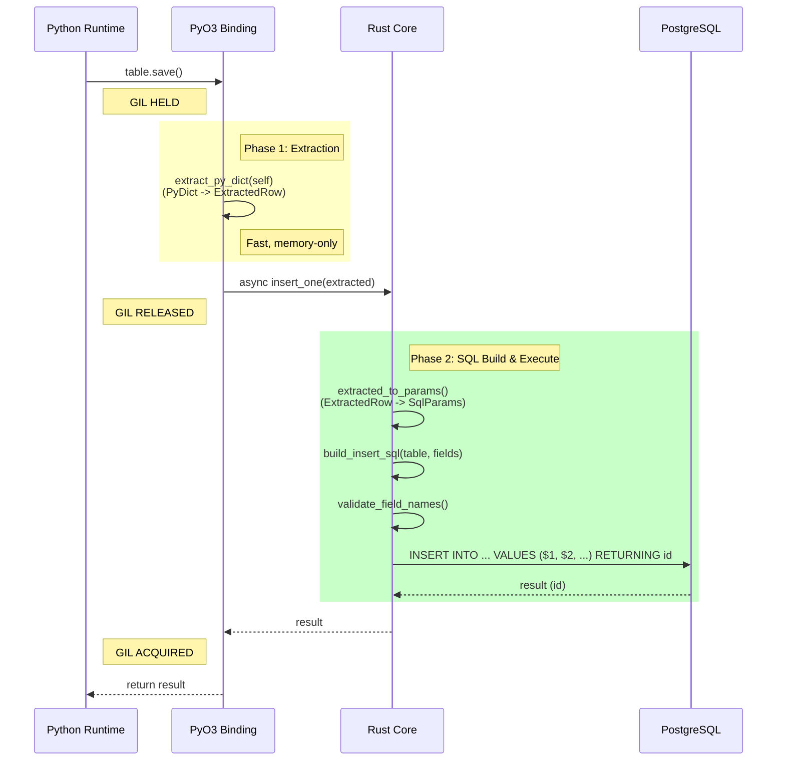
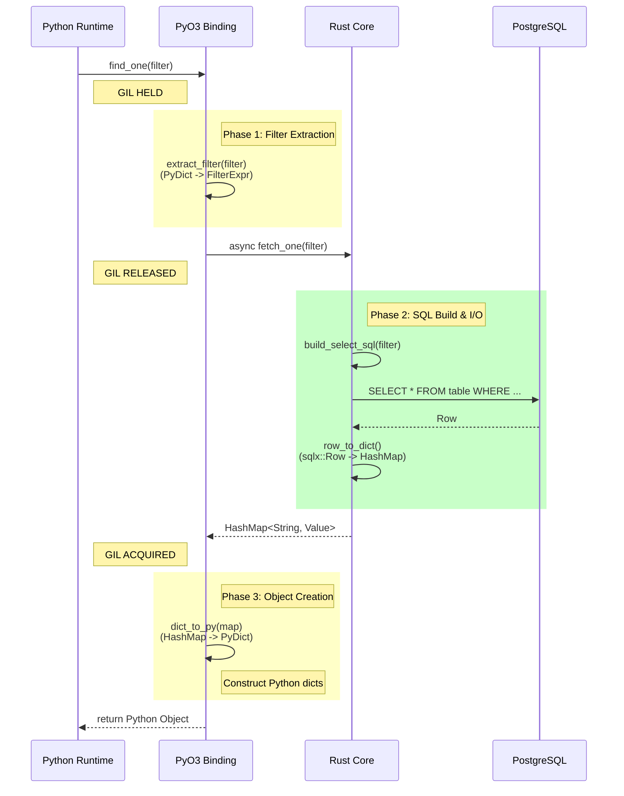
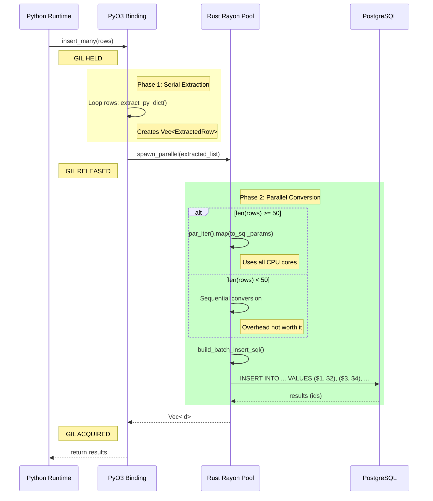
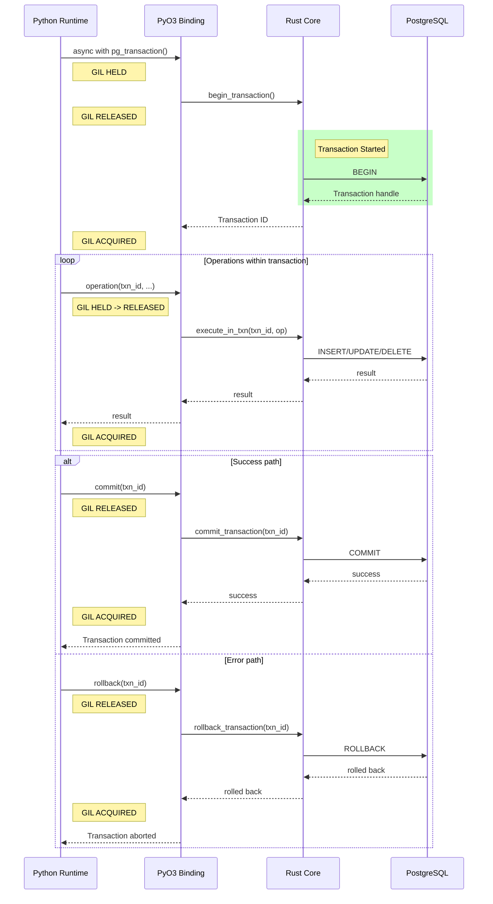
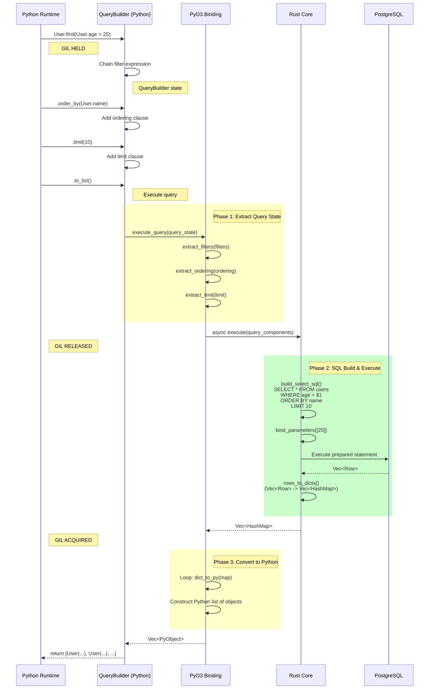
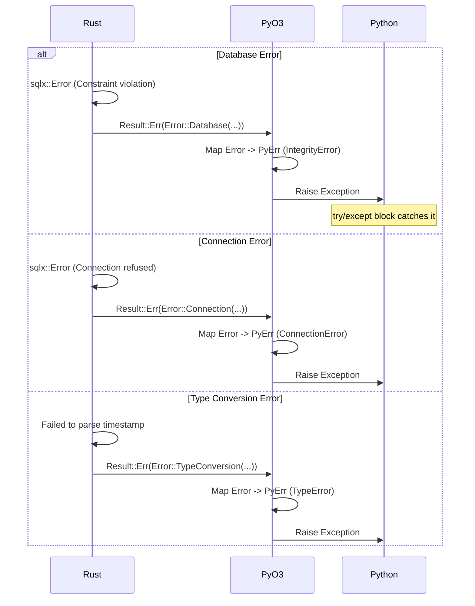

# Core PostgreSQL Data Flows

> Part of [Core PostgreSQL Engine Documentation](./index.md)

This document illustrates the data flow for key operations, highlighting the interaction between Python, PyO3, and Rust, specifically focusing on GIL management and SQL query execution.

## 1. Insert One Operation (Write Path)

Goal: Save a Python object to PostgreSQL efficiently.



## 2. Find One Operation (Read Path)

Goal: Retrieve a row and convert it to a Python dict/object.



## 3. Bulk Insert (Parallel Optimization)

Goal: Insert 10,000 rows as fast as possible with parallel conversion.



## 4. Transaction Flow

Goal: Execute multiple operations within a ACID transaction.



## 5. Query Builder Flow

Goal: Build and execute complex queries with filters, ordering, and pagination.



## Data Transformation Pipeline

The following diagram shows how data types are transformed at each stage.

```
[ Python Layer ]       [ PyO3 Bridge ]                  [ Rust Core ]              [ PostgreSQL ]
  dict {                 ExtractedRow {                   SqlParams {                SQL Wire Protocol
    "name": "A",   ->      name: String("A"),     ->        params: [              ->   Binary data
    "age": 30              age: Int(30)                       "A", 30
  }                      }                                  ]
                                                         }
      |                          |                                |
      | (GIL Held)               | (GIL Released)                 | (Network)
      +------------------------> +------------------------------> +
         Extraction                  SQL Param Binding              Wire Protocol
```

## PostgreSQL Type Mapping

```
Python Type      ExtractedValue          sqlx::Type           PostgreSQL Type
-----------      --------------          ----------           ---------------
int         ->   Int64(n)           ->   i64             ->   BIGINT
float       ->   Float64(f)         ->   f64             ->   DOUBLE PRECISION
str         ->   String(s)          ->   &str            ->   TEXT/VARCHAR
bool        ->   Bool(b)            ->   bool            ->   BOOLEAN
datetime    ->   Timestamp(ts)      ->   chrono::Dt      ->   TIMESTAMPTZ
date        ->   Date(d)            ->   chrono::Date    ->   DATE
bytes       ->   Bytes(b)           ->   &[u8]           ->   BYTEA
list        ->   List(vec)          ->   Vec<T>          ->   ARRAY
dict        ->   Json(map)          ->   serde_json      ->   JSONB
None        ->   Null               ->   Option<T>       ->   NULL
UUID        ->   Uuid(u)            ->   uuid::Uuid      ->   UUID
Decimal     ->   Decimal(d)         ->   rust_decimal    ->   NUMERIC
```

## Error Propagation Flow



## Key Design Decisions

### 1. GIL Release Strategy
- **Extract in Python land** (GIL held): Fast, minimal overhead
- **Convert & execute in Rust** (GIL released): CPU-intensive, I/O-bound work
- **Construct Python objects** (GIL acquired): Necessary for return

### 2. Parallel Conversion Threshold
- **Threshold: 50 rows**
  - Below: Sequential conversion (less overhead)
  - Above: Rayon parallel conversion (utilize all cores)

### 3. SQL Parameter Binding
- **Always use parameterized queries**: Prevents SQL injection
- **Never inline values**: Security and performance (query plan caching)
- **Type-safe binding**: sqlx validates types at compile time

### 4. Connection Pooling
- **Pool per database**: Reuse connections, avoid handshake overhead
- **Lazy initialization**: Only create connections when needed
- **Health checks**: Periodic validation of pooled connections

### 5. Transaction Management
- **Context manager pattern**: `async with pg_transaction()`
- **Automatic rollback**: On exception or explicit rollback
- **Nested transaction support**: Using SAVEPOINT (future enhancement)

## Performance Characteristics

| Operation | GIL Held Time | GIL Released Time | Bottleneck |
|-----------|---------------|-------------------|------------|
| Insert One | ~50μs (extract) | ~1-5ms (SQL exec) | Network I/O |
| Find One | ~20μs (extract) | ~1-3ms (SQL exec) | Network I/O |
| Insert Many (1000) | ~5ms (extract) | ~10-20ms (convert + exec) | CPU (conversion) |
| Transaction | ~100μs (setup) | ~5-50ms (operations) | Network I/O |
| Complex Query | ~200μs (build) | ~5-100ms (exec) | Database query planner |

**Key Insight**: By releasing GIL during SQL execution and conversion, other Python threads can run concurrently, maximizing throughput in multi-threaded applications.
