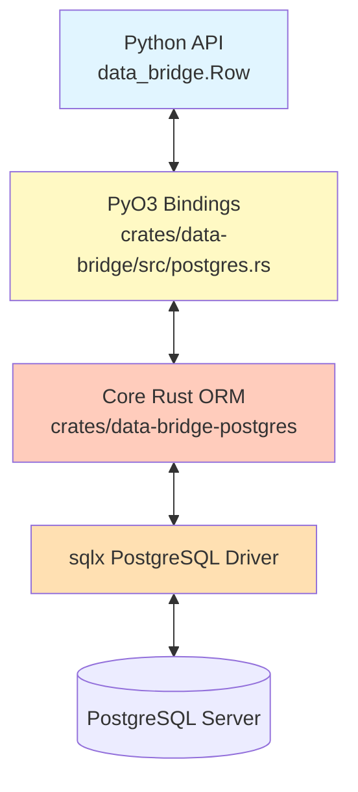

# Core PostgreSQL Engine Architecture

## Overview

The Core PostgreSQL Engine provides a high-performance, type-safe, and asynchronous interface to PostgreSQL databases. It is implemented in pure Rust (`data-bridge-postgres`) with a PyO3 binding layer (`data-bridge`) that bridges Python objects and PostgreSQL row data using sqlx.

**Key Features**:
- **Zero Python Byte Handling**: All SQL serialization/deserialization occurs in Rust.
- **Async-First Design**: Built on `tokio` and `sqlx` for efficient async I/O.
- **Type-Safe Query Builder**: Compile-time and runtime type validation.
- **Transaction Support**: Full ACID transactions with savepoints and nested transactions.
- **Migration System**: Schema versioning and automated migrations.
- **Connection Pooling**: Efficient connection management with configurable pool sizes.

## Architecture Layers

## Key Responsibilities

### 1. Connection Management
- **Connection Pooling**: Efficient pooling with configurable min/max connections
- **Health Checks**: Automatic connection health monitoring and recovery
- **SSL/TLS Support**: Secure connections with certificate validation
- **Transaction Isolation**: Configurable isolation levels (Read Committed, Serializable, etc.)

### 2. CRUD Operations
- **Row Trait**: Analogous to MongoDB's Document trait, defines table mapping
- **Type-Safe Inserts**: Validate types at compile-time and runtime
- **Batch Operations**: Efficient bulk inserts using `COPY` protocol or batch INSERTs
- **Upserts**: Support for `ON CONFLICT DO UPDATE` (PostgreSQL's UPSERT)

### 3. Query Building
- **Fluent API**: Chainable query builder with type safety
- **SQL Generation**: Generate optimized SQL queries
- **Parameterized Queries**: Prevent SQL injection via prepared statements
- **Join Support**: Type-safe joins across multiple tables
- **Aggregations**: Support for GROUP BY, HAVING, window functions

### 4. Transactions
- **ACID Guarantees**: Full transaction support
- **Savepoints**: Nested transaction support with rollback points
- **Isolation Levels**: Configurable transaction isolation
- **Deadlock Handling**: Automatic retry logic for deadlocks

### 5. Schema Migrations
- **Version Control**: Track schema versions in metadata table
- **Up/Down Migrations**: Reversible schema changes
- **Migration Runner**: Apply migrations automatically on startup or manually
- **Rollback Support**: Safe rollback to previous schema versions

## Documentation Structure

### 1. [00-architecture.md](./00-architecture.md)
High-level architectural patterns, including:
- Connection pool management strategy
- **GIL Release Strategy** for async operations
- Row-to-Python conversion pipeline
- Security and SQL injection prevention

### 2. [10-components.md](./10-components.md)
Detailed breakdown of key components:
- **Connection Pool**: Configuration and lifecycle management
- **Row Trait**: Foundation for table mapping and CRUD operations
- **Query Builder**: Type-safe SQL generation
- **Transaction Manager**: ACID transaction handling
- **Migration Engine**: Schema versioning system

### 3. [20-data-flows.md](./20-data-flows.md)
Sequence diagrams illustrating:
- **Write Path**: Python Dict → ExtractedValue → SQL Parameters → DB
- **Read Path**: DB → SQL Rows → ExtractedValue → Python Object
- **Transaction Flow**: BEGIN → Operations → COMMIT/ROLLBACK
- **Migration Flow**: Version check → Apply migrations → Update metadata

### 4. [30-implementation-details.md](./30-implementation-details.md)
Implementation details:
- File structure of `crates/data-bridge-postgres`
- Key data structures (`RustRow`, `ExtractedValue`, `SqlValue`)
- Error handling patterns
- Performance benchmarks vs SQLAlchemy/asyncpg

## Success Criteria

- 🎯 **Performance**: >2x faster than SQLAlchemy for batch operations
- 🎯 **Safety**: Zero unsafe Rust code causing panics/crashes
- 🎯 **Concurrency**: Efficient connection pooling with minimal contention
- 🎯 **Memory**: Minimal Python heap usage during large queries
- 🎯 **Type Safety**: Compile-time type checking where possible

## Technical Stack

- **Database Driver**: `sqlx` 0.7+ (async PostgreSQL driver)
- **Runtime**: `tokio` 1.40+ (async runtime)
- **Connection Pool**: Built-in sqlx pool with deadpool integration
- **Type System**: Rust type system + PostgreSQL type mapping
- **Migration Tool**: Custom migration runner using sqlx migrations

## References

- **Pure Rust Crate**: `crates/data-bridge-postgres/` (to be created)
- **PyO3 Bindings**: `crates/data-bridge/src/postgres.rs` (to be created)
- **Python Layer**: `python/data_bridge/postgres.py` (to be created)
- **sqlx Documentation**: https://docs.rs/sqlx/
- **PostgreSQL Documentation**: https://www.postgresql.org/docs/
