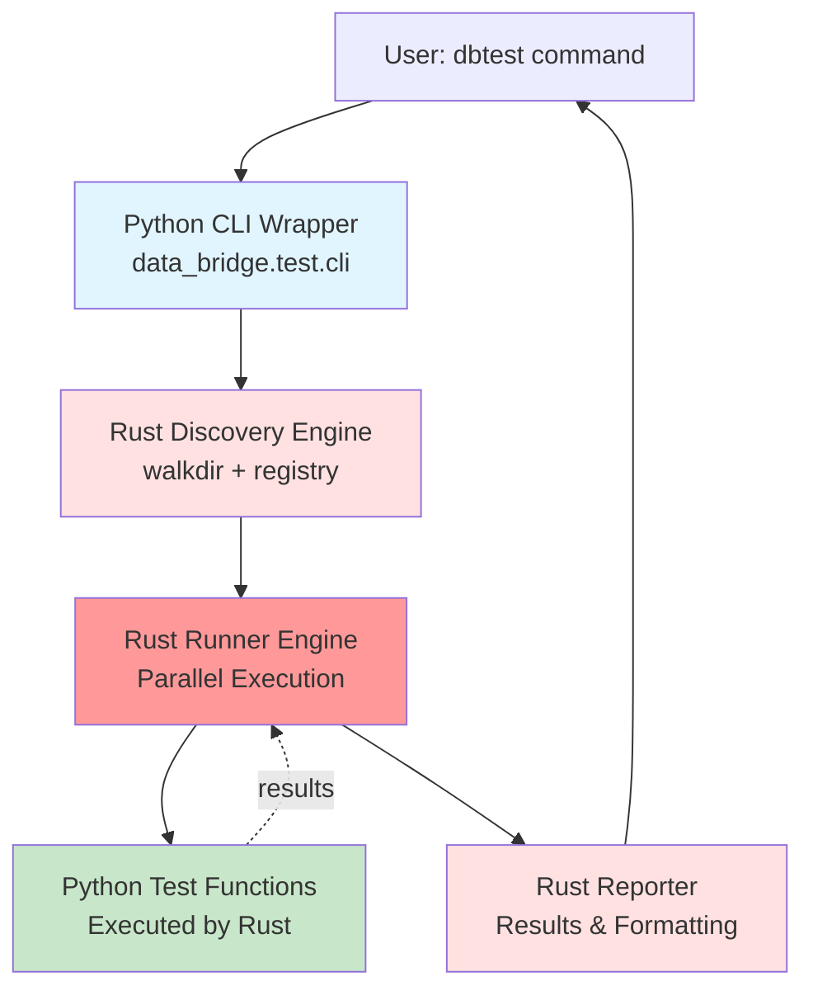
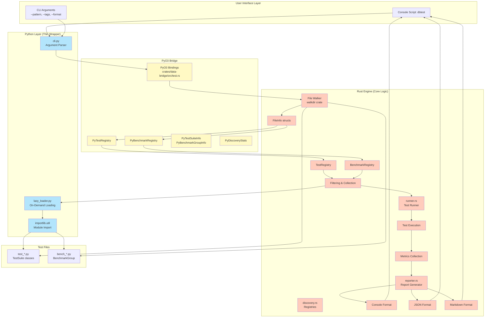

# System Architecture

> Part of [dbtest Architecture Documentation](./README.md)

## High-Level Architecture



**Architecture Principles**:
- **Rust Engine**: All orchestration, scheduling, and execution in Rust
- **Parallel Execution**: Tokio-based task scheduling for concurrent test runs
- **Minimal Python**: Python only for CLI and test function definitions
- **Performance**: Rust manages event loop, GIL release, and resource allocation
- **Fast Discovery**: Rust walkdir (~2ms for 100 files)
- **Lazy Loading**: Modules loaded on-demand by Rust via PyO3

## Detailed Component Architecture



## Layer Responsibilities

### Python Layer (Thin Wrapper)
- **cli.py**: CLI argument parsing, command routing
- **Test Functions**: Actual test/benchmark implementations
- **Minimal Orchestration**: Delegates to Rust engine immediately
- **Zero Execution Logic**: Rust handles all scheduling and execution

### PyO3 Bridge Layer
- **test.rs**: Python bindings for Rust types
- **Async Python Calls**: Bridge Rust Tokio ↔ Python async functions
- **pyo3-asyncio**: Handles async Python function execution from Rust
- **Type Conversion**: Rust ↔ Python data conversion
- **Thread-safe**: Arc<Mutex<>> for shared state

### Rust Engine Layer (THE RUNNER)
- **discovery.rs**: Fast file discovery (walkdir), registries, filtering
- **runner.rs**: **CORE EXECUTION ENGINE**
  - Parallel test execution with Tokio
  - Task scheduling and resource management
  - Calls Python async functions via pyo3-asyncio
  - GIL release management
  - Event loop control
- **reporter.rs**: Report generation and formatting
- **Performance-critical**: All orchestration in Rust

## Performance Targets

| Operation | Target | Implementation |
|-----------|--------|----------------|
| Discovery | <3ms for 100 files | Rust walkdir |
| Module Loading | On-demand only | Rust-triggered lazy loading |
| Filtering | <10ms for 1000 tests | Rust registry operations |
| **Parallel Execution** | **N tests in T/N time** | **Rust Tokio task scheduler** |
| **Task Scheduling** | **<1ms overhead** | **Rust async runtime** |
| GIL Management | Minimal contention | Rust controls GIL release |
| Reporting | <50ms | Rust reporter with formatting |
| CLI Startup | <200ms cold | Python argparse → Rust |

## Rust Runner Capabilities

### Parallel Test Execution
```rust
// Rust runner spawns parallel tasks
tokio::spawn(async move {
    // Call Python test function
    let result = call_python_test(test_func).await;
    results.lock().await.push(result);
});
```

**Benefits:**
- ✅ Run N tests concurrently (configurable parallelism)
- ✅ Efficient task scheduling with Tokio
- ✅ Automatic load balancing
- ✅ Resource limits (max concurrent tasks)

### GIL Management
```rust
// Rust releases GIL between Python calls
Python::with_gil(|py| {
    // Acquire GIL, call Python
    call_test_function(py, test)
}); // GIL released
// Other tasks can run while waiting
```

**Benefits:**
- ✅ No GIL contention between tests
- ✅ Rust manages when Python runs
- ✅ Better CPU utilization

## Key Architectural Decisions

### 1. Rust as the Runner/Execution Engine (NEW)
**Decision**: Rust orchestrates all test execution, not Python
- **Rationale**:
  - Parallel execution with Tokio (N tests concurrently)
  - Better task scheduling and resource management
  - GIL control for minimal contention
  - Reduced Python overhead
- **Implementation**:
  - Rust runner.rs with Tokio runtime
  - pyo3-asyncio for calling Python async functions
  - Task spawning with configurable parallelism
- **Performance Gain**: N tests in ~T/N time (near-linear scaling)

### 2. Rust-First Discovery
**Decision**: Use Rust walkdir crate for file discovery, not Python glob
- **Rationale**: 10-50x faster (~2ms vs 50-100ms for 100 files)
- **Trade-off**: More complex than pure Python, but worth the performance gain

### 3. Lazy Module Loading
**Decision**: Only load Python modules that will be executed
- **Rationale**: Don't pay import cost for filtered-out tests
- **Implementation**: Rust triggers Python lazy_loader when needed

### 4. Console Script, Not Rust Binary
**Decision**: Python CLI wrapper, not standalone Rust binary
- **Rationale**: Easier install (pip/uv), works with venv, simpler distribution
- **Trade-off**: Python startup overhead (~200ms) vs Rust binary
- **Note**: CLI hands off to Rust runner immediately

### 5. Standalone, Not pytest Plugin
**Decision**: Independent tool, doesn't integrate with pytest
- **Rationale**: User requirement, simpler implementation, full control over execution
- **Coexistence**: Can run both pytest and dbtest in same project
- **Benefit**: Rust can fully control the execution model

### 6. No Registry Cache
**Decision**: Discover fresh on each run, no persistent cache
- **Rationale**: Fast enough (<3ms), simpler, no stale cache issues
- **Trade-off**: Repeat work vs cache invalidation complexity

### 7. Tokio Runtime for Async
**Decision**: Use Tokio for async runtime, not Python asyncio
- **Rationale**:
  - Better performance and scheduling
  - Control over parallelism
  - GIL release between tasks
- **Implementation**: pyo3-asyncio bridges Tokio ↔ Python async

## See Also

- [State Machines](./state-machines.md) - Lifecycle state machines
- [Data Flows](./data-flows.md) - Sequence diagrams
- [Components](./components.md) - Detailed component responsibilities
- [Implementation](./implementation.md) - File structure and patterns
