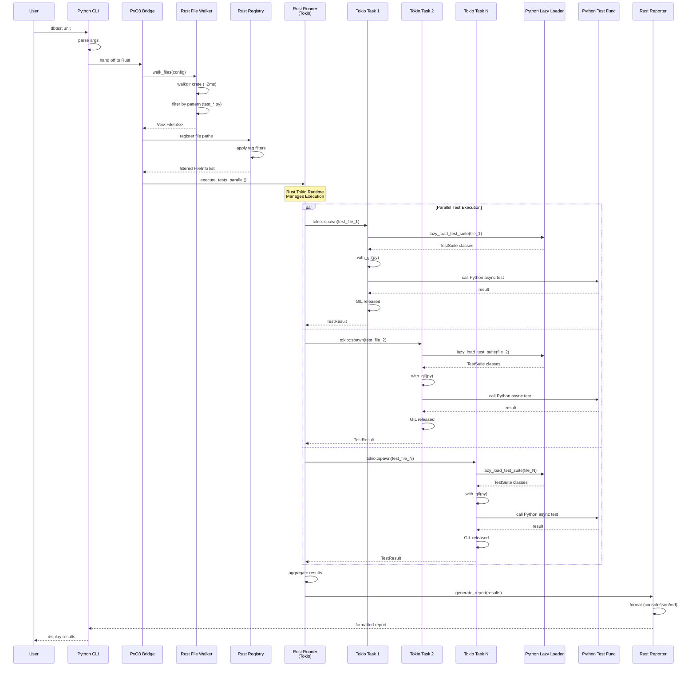
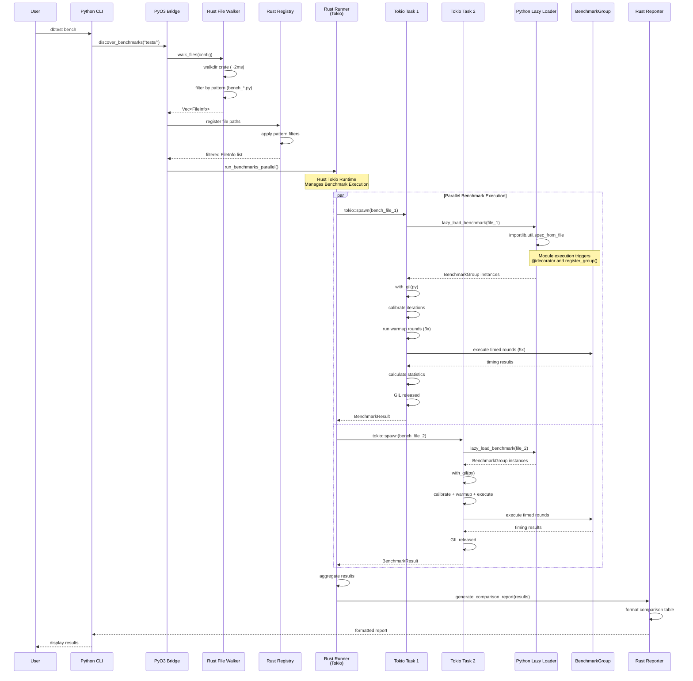
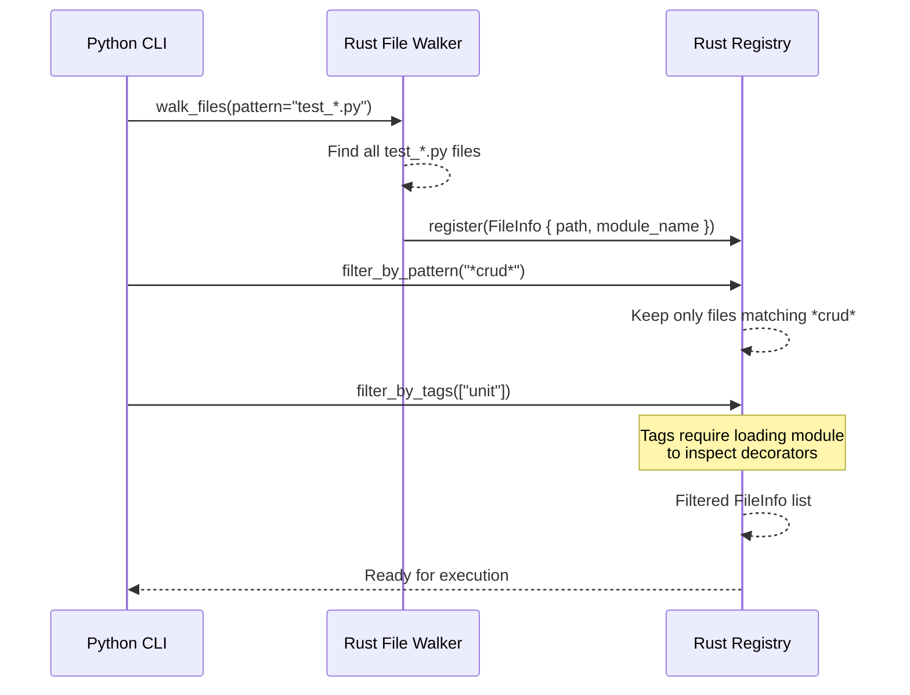
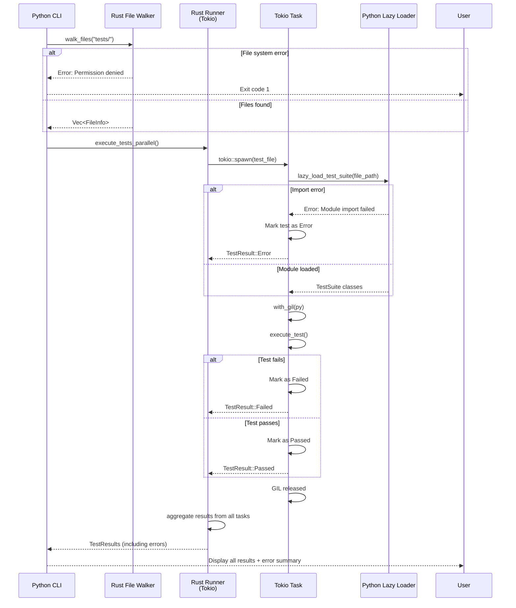

# Data Flows

> Part of [dbtest Architecture Documentation](./README.md)

This document shows the sequence of operations and data flow through the dbtest system for different execution paths.

## Test Discovery & Execution Flow (Rust Runner)



**Key Points**:
1. **Rust is the Runner**: Tokio runtime manages all test execution
2. **Parallel Execution**: Multiple tests run concurrently via tokio::spawn
3. **GIL Management**: Each task acquires/releases GIL as needed
4. **Fast Discovery**: Rust walkdir finds files in ~2ms
5. **Lazy Loading**: Python modules loaded on-demand by Rust
6. **Performance**: N tests in ~T/N time (near-linear scaling)

## Benchmark Discovery & Execution Flow



**Key Points**:
1. **Rust is the Runner**: Tokio runtime manages all benchmark execution
2. **Parallel Execution**: Multiple benchmark files run concurrently via tokio::spawn
3. **GIL Management**: Each task acquires/releases GIL as needed
4. **Same Discovery**: Uses same Rust walkdir approach
5. **Lazy Loading**: Benchmark files loaded on-demand by Rust
6. **Auto-Registration**: BenchmarkGroup registers during module import
7. **Statistics**: Mean, median, stddev, percentiles calculated in Rust
8. **Performance**: N benchmark files in ~T/N time (near-linear scaling)

## Filtering Flow



**Filtering Strategy**:
- **File Pattern**: Applied during walkdir (fast, no I/O)
- **Name Pattern**: Applied on FileInfo list (fast, string match)
- **Tags**: Requires lazy loading module to inspect decorators (slower)

## Error Handling Flow



**Error Handling Principles**:
- **Fail Fast for Discovery**: File system errors exit immediately
- **Collect Test Errors**: Import/execution errors are collected per task, not fatal
- **Task Isolation**: Each Tokio task handles its own errors independently
- **Final Report**: Rust runner aggregates all results including errors
- **Exit Code**: Non-zero if any tests failed or errored
- **GIL Safety**: GIL released even on error paths

## Performance Optimization Points

### Critical Path (Discovery to Execution)

```
1. CLI startup              ~200-300ms  (Python import overhead)
   ↓
2. walkdir file discovery   ~2-3ms      (Rust walkdir, 100 files)
   ↓
3. Filtering                ~0.1-1ms    (Rust string matching)
   ↓
4. Tokio runtime init       ~1-2ms      (Rust async runtime)
   ↓
5. Parallel execution       ~T/N        (N tests in parallel)
   │
   ├─ Lazy module loading   ~10-50ms    (Python importlib, per file, parallel)
   ├─ GIL acquire           ~0.1ms      (per task, minimal contention)
   ├─ Test execution        Variable    (User test code)
   └─ GIL release           ~0.1ms      (per task)
   ↓
6. Result aggregation       ~1-5ms      (Rust, concurrent collection)
   ↓
7. Report generation        ~10-50ms    (Rust formatting)
```

**Performance Gains from Rust Runner**:
- **Parallel Execution**: N tests in ~T/N time (near-linear scaling)
- **Task Scheduling**: <1ms overhead per task (Tokio)
- **GIL Management**: Minimal contention (released between Python calls)
- **Concurrent Loading**: Multiple modules load in parallel
- **Efficient Aggregation**: Rust collects results without Python overhead

**Bottlenecks**:
- **CLI Startup**: Python import overhead (~200-300ms) - unavoidable
- **Module Loading**: Mitigated by parallel loading (all files load concurrently)
- **Test Execution**: Dominated by actual test logic (but parallelized)

**Optimizations**:
- ✅ Use Rust walkdir (10-50x faster than Python glob)
- ✅ Lazy loading (don't load filtered-out files)
- ✅ Filtering in Rust (faster than Python)
- ✅ Parallel execution with Tokio (N tests → T/N time)
- ✅ GIL release management (no contention)
- ✅ Concurrent module loading (all files load in parallel)
- ❌ Not caching (complexity not worth <3ms savings)

## See Also

- [Architecture](./architecture.md) - System architecture
- [State Machines](./state-machines.md) - Lifecycle states
- [Components](./components.md) - Component responsibilities
