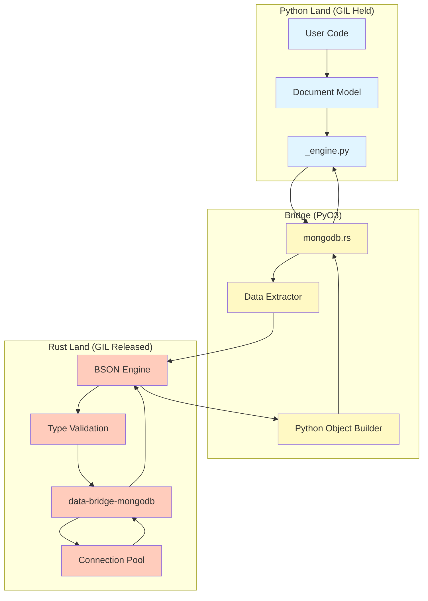

# Core MongoDB Architecture

> Part of [Core MongoDB Engine Documentation](./README.md)

## High-Level Architecture

The system is designed around the principle of **offloading work to Rust**. Python acts as a high-level API and orchestrator, while Rust handles the data intensive tasks of serialization, validation, and network I/O.



## Architectural Principles

### 1. Zero Python Byte Handling
Traditional Python drivers receive raw BSON bytes from the network and decode them into Python dictionaries. This puts massive pressure on the Python heap and Garbage Collector.

**Our Approach**:
1. Rust driver receives BSON.
2. Rust deserializes BSON into **Rust structs** (not Python objects yet).
3. Data is filtered/transformed in Rust.
4. Only final, necessary data is converted to Python objects.

### 2. GIL Release Strategy
The Global Interpreter Lock (GIL) is the bottleneck for concurrency in Python. We minimize the time the GIL is held.

| Operation | GIL State | Description |
| :--- | :--- | :--- |
| **Data Extraction** | **Held** | Extracting data from Python objects (fast). |
| **BSON Conversion** | **Released** | Converting extracted data to BSON (slow, CPU intensive). |
| **Validation** | **Released** | Checking constraints and types. |
| **Network I/O** | **Released** | Sending/Receiving data from MongoDB. |
| **Object Creation** | **Held** | Creating final Python objects (fast). |

### 3. Parallel Batch Processing
For operations like `insert_many` or large `find` queries, we use **data parallelism**.

- **Writes**: Input list is partitioned. `rayon` converts chunks to BSON in parallel (GIL released).
- **Reads**: Result batches are deserialized in parallel before GIL acquisition.

### 4. Intermediate Representation (`ExtractedValue`)
To allow GIL release, we cannot access Python objects directly during BSON conversion. We use an intermediate enum `ExtractedValue` that holds the data in a Rust-friendly format.

```rust
pub enum ExtractedValue {
    String(String),
    Int(i64),
    Float(f64),
    List(Vec<ExtractedValue>),
    Dict(HashMap<String, ExtractedValue>),
    ObjectId(oid::ObjectId),
    // ...
}
```

1. **Phase 1 (GIL Held)**: Fast iteration over Python objects to populate `ExtractedValue`.
2. **Phase 2 (GIL Released)**: Convert `ExtractedValue` to `Bson`.

## Security Architecture

The core enforces security at the boundary:

1. **Injection Prevention**: 
   - Collection names are validated against a strict regex.
   - Field names cannot start with `$` (unless explicitly allowed operators).
2. **Query Sanitization**:
   - Queries are parsed and structurally validated.
   - Dangerous operators (`$where`, `$function`) are blocked by default.
3. **Type Safety**:
   - `ObjectId`s are strictly validated.
   - Numeric overflows are caught before DB insertion.

## Performance Characteristics

| Metric | Traditional (PyMongo) | data-bridge (Rust) | Improvement |
| :--- | :--- | :--- | :--- |
| **Insert 1k docs** | ~50ms | ~17ms | **3x Faster** |
| **Find 1k docs** | ~9ms | ~6ms | **1.5x Faster** |
| **Memory Usage** | High (temporary objects) | Low (Rust stack/heap) | **Significant** |
| **CPU Usage** | Single core (GIL bound) | Multi-core (Rayon) | **Scalable** |
