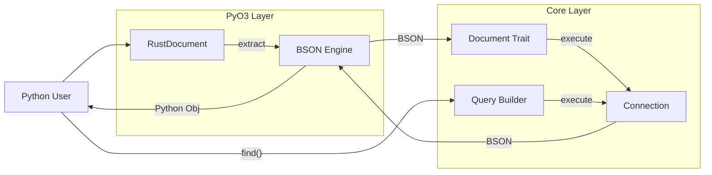

# Core MongoDB Components

> Part of [Core MongoDB Engine Documentation](./README.md)

This document details the responsibilities and internals of the key components in the MongoDB engine.

## 1. Connection Manager (`connection.rs`)

**Role**: Manages the lifecycle of MongoDB client and database connections.

**Key Responsibilities**:
- **Pooling**: wrappers around `mongodb::Client` which manages the connection pool internally.
- **Configuration**: Handles URI parsing, timeout settings, and SSL configuration.
- **Health Checks**: Provides methods to `ping` the database to ensure connectivity.
- **Thread Safety**: Designed to be shared across threads (`Arc<Client>`).

**Rust Type**:
```rust
pub struct Connection {
    client: mongodb::Client,
    database: mongodb::Database,
}
```

## 2. Document Trait (`document.rs`)

**Role**: The abstraction for any entity that can be stored in MongoDB.

**Key Responsibilities**:
- **CRUD Interface**: Defines `insert_one`, `find_one`, `update_one`, `delete_one`, etc.
- **Serialization**: Requires `Serialize` and `Deserialize` (from `serde`).
- **Collection Binding**: Each implementation is bound to a specific collection name.
- **ID Management**: Enforces the presence of an `_id` field (usually `ObjectId`).

**Signature**:
```rust
#[async_trait]
pub trait Document: Serialize + DeserializeOwned + Send + Sync {
    fn collection_name() -> &'static str;
    
    async fn find_one(filter: Document, options: Option<FindOneOptions>) -> Result<Option<Self>>;
    async fn insert_one(&self, options: Option<InsertOneOptions>) -> Result<InsertOneResult>;
    // ...
}
```

## 3. Query Builder (`query.rs`)

**Role**: Provides a fluent, type-safe API for constructing MongoDB queries.

**Key Responsibilities**:
- **Chaining**: methods like `.filter()`, `.sort()`, `.limit()`, `.project()` return `Self`.
- **Validation**: Ensures query operators are used correctly.
- **Execution**: Can execute the query directly (`.await` or `.to_list()`).

**Rust Type**:
```rust
pub struct QueryBuilder<'a, T> {
    collection: Collection<T>,
    filter: Document,
    sort: Option<Document>,
    limit: Option<i64>,
    skip: Option<u64>,
    // ...
}
```

## 4. PyO3 Binding (`mongodb.rs`)

**Role**: The bridge between Python and Rust.

**Key Components**:

### `RustDocument` (Python Class)
The main class exposed to Python. It wraps the core logic.
- **`__init__`**: Accepts a dictionary or kwargs.
- **`save`**: Serializes to BSON and calls `insert_one` or `update_one`.
- **`delete`**: Calls `delete_one`.

### `BSON Engine` (Internal)
The conversion logic functions.
- **`extract_py_value`**: Recursive function to convert `PyObject` -> `ExtractedValue`. Handles Python types (`dict`, `list`, `str`, `int`, `datetime`, `ObjectId`).
- **`extracted_to_bson`**: Converts `ExtractedValue` -> `bson::Bson`. Pure Rust, no GIL.
- **`bson_to_py`**: Converts `bson::Bson` -> Python objects. Creates Python `dict`, `list`, etc.

### `SecurityValidator` (Internal)
- **`validate_collection_name`**: Ensures collection names match `^[a-zA-Z0-9_]+$`.
- **`scan_query`**: Recursively checks a query document for prohibited operators.

## 5. Shared Utilities (`data-bridge-common`)

**Role**: Common types used across crates.

- **`Error`**: Centralized error enum handling `MongoError`, `BsonError`, `PyErr`, etc.
- **`OID`**: Wrapper around `bson::oid::ObjectId` to simplify PyO3 conversion.

## Component Interaction


