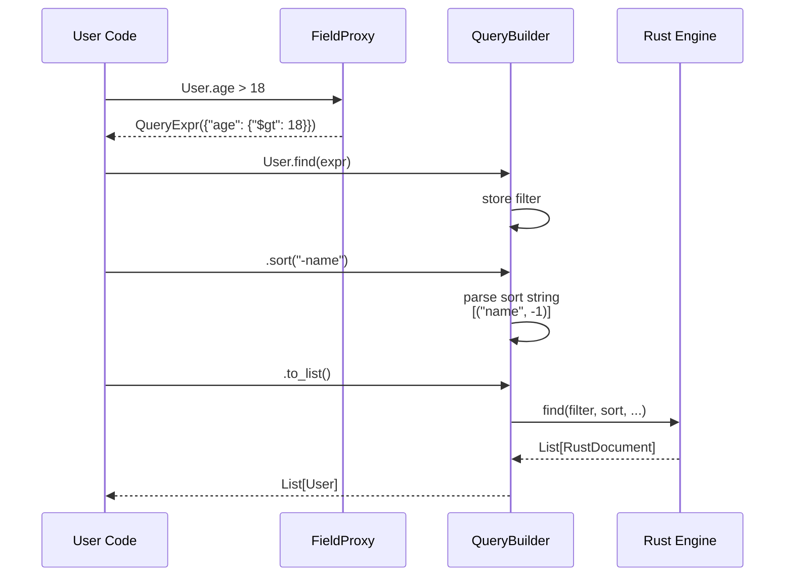
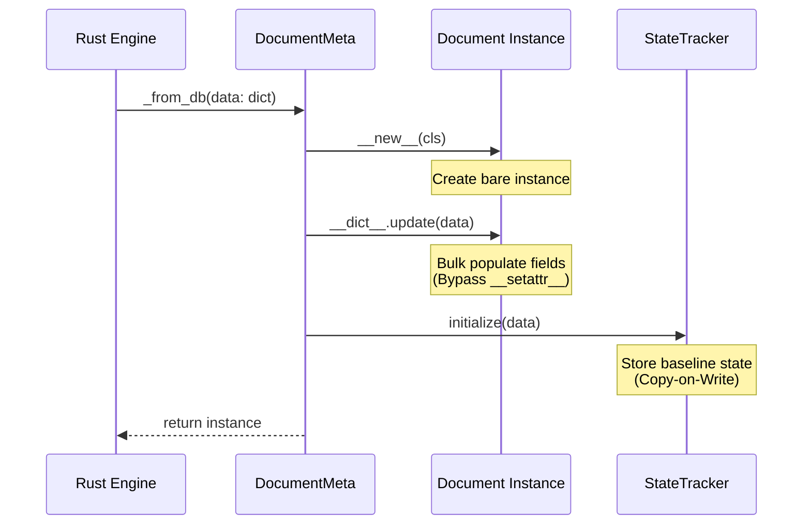
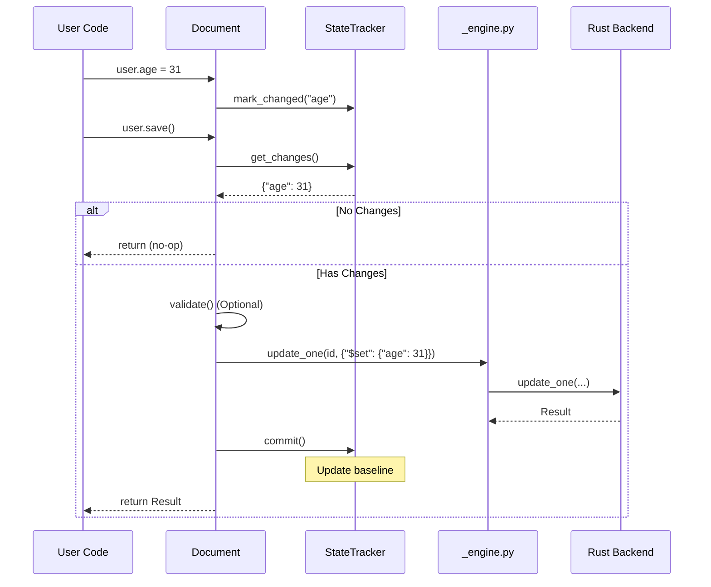

# Python Layer Data Flows

> Part of [Python API Layer Documentation](./README.md)

## 1. Query Construction Flow

Goal: Transform `User.find(User.age > 18).sort("-name")` into a MongoDB query.

## 2. Document Hydration Flow

Goal: Convert raw data from Rust into a fully functional `User` instance.

## 3. Save Lifecycle (Update)

Goal: Save a modified document.

