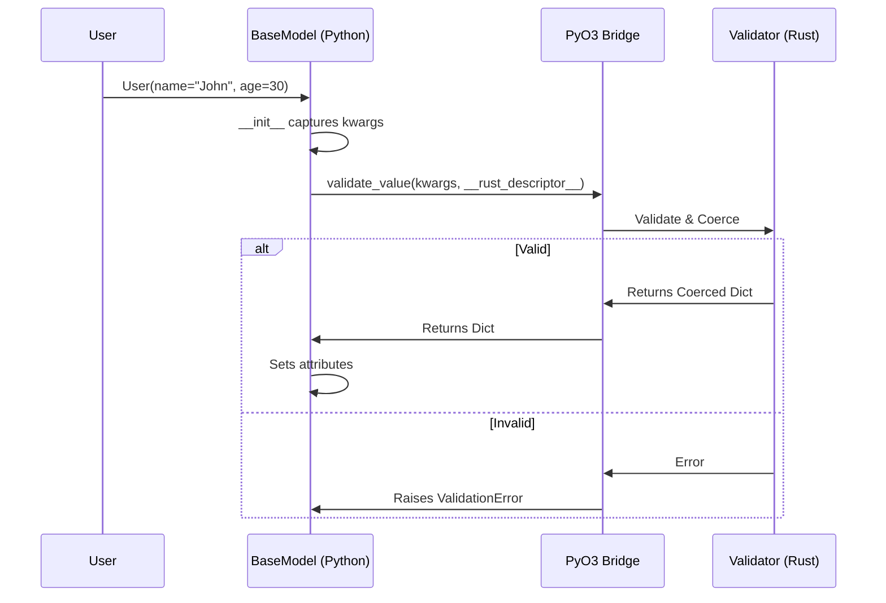

# Design: Standalone Rust-Backed Validation

## Goals
1.  **Zero-Dependency Pydantic Replacement**: Provide a `BaseModel` that feels like Pydantic v2 but requires no external Python packages.
2.  **Performance**: Offload all validation logic to the existing high-performance Rust engine.
3.  **Interoperability**: Allow this validation system to be used outside the API server (e.g., in scripts, other frameworks).

## Architecture

### 1. The `ouroboros.validation` Module
A new standalone Python module that contains:
-   `BaseModel`: The base class for defining schemas.
-   `Field`: Configuration for validation constraints.
-   `TypeDescriptor`: Helper to generate Rust-compatible schema definitions.

### 2. Validation Flow

### 3. Schema Extraction (Static)
We use `__init_subclass__` to analyze types once at class definition time.
-   **Inputs**: Python Type Hints (`str`, `int`, `Annotated[str, Field(min_length=5)]`).
-   **Process**: Recursively build a JSON-serializable `TypeDescriptor`.
-   **Output**: Stored in `cls.__rust_descriptor__`.

### 4. Recursive Nested Models
For nested models (`class A(BaseModel): b: B`), the `TypeDescriptor` for `A` must embed the structure of `B`.
-   Since `B` is already defined, we can access `B.__rust_descriptor__`.
-   If `B` is a forward reference, we resolve it lazily or use `TypeDescriptor::Object` with a unique ID reference (future optimization). For now, we assume ordered definition or simple embedding.

## Decisions
-   **API Style**: mimic Pydantic v2 (`Annotated`, `model_dump`, `model_validate`) to minimize learning curve.
-   **Validation Engine**: Use `data-bridge-api::validation` which is already security-hardened.
-   **Serialization**: `model_dump()` remains Python-side for now, but `model_json()` (to string) will use Rust's `serde_json` for speed.

## Alternatives Considered
-   **Using `pydantic-core`**: Adding a dependency on `pydantic-core` would solve performance but violates the "Zero Dependencies" rule.
-   **Pure Python Validation**: Too slow, defeats the purpose of the project.
