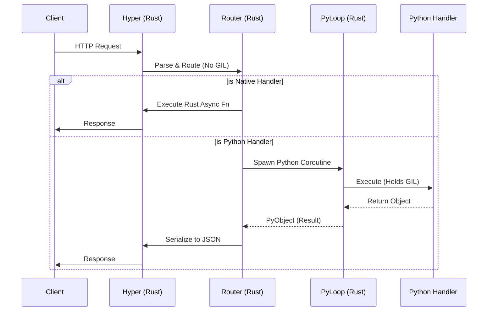

# Design: PyLoop + HTTP Server Integration

## Context
The goal is to eliminate the overhead of ASGI and standard Python web servers by letting Rust handle the "heavy lifting" of HTTP. Python should only be invoked when business logic requires it.

## Architecture: The Hybrid Dispatcher

### 1. Unified Runtime Model
Instead of Python starting a loop (uvloop) and Rust starting a runtime (Tokio), we invert control:
1.  Python script starts.
2.  User calls `app.run()`.
3.  Rust initializes **Global Tokio Runtime** (singleton).
4.  `PyLoop` installs itself as the Python Event Loop on this runtime.
5.  Hyper Server spawns on the *same* runtime.

### 2. Request Lifecycle


### 3. Declarative DSL (Type-Driven CRUD)
To further reduce Python overhead, we introduce "Type-Driven Routes".

**User Code:**
```python
class User(Model):
    id: UUID
    name: str

@app.crud(User)
class UserRoutes:
    pass
```

**Rust Implementation:**
1.  `app.crud` decorator captures the `User` class.
2.  Calls Rust `register_crud(schema: PyObject)`.
3.  Rust inspects `schema` fields (using `pyo3`).
4.  Rust registers 5 optimized handlers:
    - `GET /user` -> `handlers::list::<User>`
    - `POST /user` -> `handlers::create::<User>`
    - etc.
5.  These handlers use the **MongoDB ORM** directly in Rust.
    - **Zero Python execution** for standard CRUD operations.

## Data Exchange
- **Request**: Hyper `Request` -> `SerializableRequest` (Rust struct) -> (only if Python handler) -> `PyRequest` (Python object).
- **Response**: Python returns `dict` or `PydanticModel` -> Rust converts to `serde_json::Value` -> Hyper `Response`.

## Performance Strategy
1.  **Lazy Conversion**: Don't convert HTTP body to Python `bytes`/`str` until the handler actually requests it.
2.  **Gil-Free Routing**: Path matching, query parsing, and header validation happen without the GIL.
3.  **Thread Safety**: Python handlers are scheduled on the `LocalSet` of the thread that holds the GIL, or via `PyLoop`'s task queue.

## 4. PyLoop Bridge API Design

### spawn_python_handler (New API)
**Signature**:
```rust
pub fn spawn_python_handler(
    &self,
    callable: PyObject,
    args: PyObject,
) -> impl Future<Output = PyResult<PyObject>>
```

**Implementation Strategy**:
```rust
use tokio::sync::oneshot;

pub fn spawn_python_handler(
    &self,
    callable: PyObject,
    args: PyObject,
) -> impl Future<Output = PyResult<PyObject>> {
    let (tx, rx) = oneshot::channel();

    // Schedule Python execution on PyLoop
    self.call_soon_threadsafe(move || {
        Python::with_gil(|py| {
            // Detect if callable returns coroutine
            let result = callable.call1(py, &args)?;
            let is_coro = result.hasattr(py, "__await__")?;

            if is_coro {
                // Poll coroutine to completion (Phase 4: improve this)
                let final_result = self.run_until_complete(py, result)?;
                tx.send(final_result).ok();
            } else {
                // Sync function, return directly
                tx.send(result).ok();
            }
            Ok(())
        })
    })?;

    async move {
        rx.await.map_err(|_| PyLoopError::TaskCancelled)?
    }
}
```

**Key Properties**:
- GIL acquired only during Python execution
- Non-blocking wait in Rust (async channel)
- Handles both sync and async Python handlers
- Compatible with Tokio's async ecosystem

### Coroutine Polling Strategy

**Current Issue**:
`task.rs` uses blocking poll loop:
```rust
loop {
    match poll_coroutine(py, coro) {
        Ok(PollResult::Pending(_)) => {
            std::thread::sleep(Duration::from_millis(10));  // ❌ Blocks thread!
        }
    }
}
```

**Phase 1 Solution (Workaround)**:
```rust
// Use Tokio's spawn_blocking for now
tokio::task::spawn_blocking(move || {
    Python::with_gil(|py| {
        let event_loop = get_or_create_event_loop(py)?;
        event_loop.call_method1(py, "run_until_complete", (coro,))?
    })
})
```
- **Pro**: Doesn't block HTTP workers
- **Con**: Thread pool overhead (~50µs per spawn)

**Phase 4 Solution (Future Enhancement)**:
Implement proper awaitable protocol:
1. When coroutine yields, check if awaiting a Rust Future
2. If so, convert to Tokio future and poll it
3. Resume coroutine with result
- **Benefit**: True async integration, no blocking

## 5. Error Handling Strategy

### Python Exception → HTTP Response Mapping

**Exception Types**:
```python
# User-defined HTTP errors
class HTTPException(Exception):
    status_code: int
    detail: str

# Pydantic validation errors
class ValidationError(Exception):
    errors: List[Dict]

# MongoDB errors
class DatabaseError(Exception):
    pass
```

**Rust Handling**:
```rust
fn convert_python_error(py_err: PyErr) -> Response {
    Python::with_gil(|py| {
        if py_err.is_instance_of::<PyTypeError>(py) {
            Response::error("Invalid request type").with_status(400)
        } else if py_err.matches(py, "ValidationError") {
            Response::error("Validation failed").with_status(422)
        } else if py_err.matches(py, "HTTPException") {
            let status = py_err.value(py).getattr("status_code")?.extract()?;
            let detail = py_err.value(py).getattr("detail")?.extract()?;
            Response::error(detail).with_status(status)
        } else {
            // Unhandled exception - log and return 500
            error!("Unhandled Python exception: {:?}", py_err);
            Response::error("Internal server error").with_status(500)
        }
    })
}
```

### Request Timeout Management

**Design**:
```rust
use tokio::time::{timeout, Duration};

async fn execute_python_handler_with_timeout(
    pyloop: &PyLoop,
    callable: PyObject,
    args: PyObject,
    timeout_ms: u64,
) -> Result<Response, ApiError> {
    match timeout(
        Duration::from_millis(timeout_ms),
        pyloop.spawn_python_handler(callable, args)
    ).await {
        Ok(Ok(result)) => Ok(convert_to_response(result)),
        Ok(Err(py_err)) => Ok(convert_python_error(py_err)),
        Err(_) => Ok(Response::error("Request timeout").with_status(504)),
    }
}
```

**Configuration**:
- Default timeout: 30 seconds
- Configurable per-route: `@app.get("/slow", timeout=60)`
- Can be disabled: `timeout=None`

## 6. Middleware Integration

### Rust Middleware (Primary)

**Supported via Tower**:
```rust
use tower_http::{cors::CorsLayer, compression::CompressionLayer};

let app = Router::new()
    .layer(CorsLayer::permissive())
    .layer(CompressionLayer::new())
    .layer(RequestLogLayer::new());
```

**Benefits**:
- Zero GIL overhead
- High performance (processing at Rust speed)
- Standard ecosystem (tower middleware)

### Python Middleware (Optional)

**Design**:
```python
@app.middleware
async def custom_middleware(request, call_next):
    # Pre-processing
    start = time.time()

    # Call handler
    response = await call_next(request)

    # Post-processing
    response.headers["X-Process-Time"] = str(time.time() - start)
    return response
```

**Implementation**:
- Wrapped as a Python handler
- Applied before/after actual handler
- **Warning**: Adds Python overhead to every request

**Recommendation**: Use Rust middleware for high-throughput paths, Python middleware only for development/debugging.

## 7. Graceful Shutdown Coordination

**Challenge**: Need to coordinate PyLoop and Hyper shutdown

**Design**:
```rust
pub async fn run_server(
    app: App,
    pyloop: Arc<PyLoop>,
) -> Result<(), ServerError> {
    let router = app.build_router()?;

    // Setup signal handler
    let shutdown_signal = async {
        tokio::signal::ctrl_c().await.ok();
        info!("Shutdown signal received");
    };

    // Start HTTP server with graceful shutdown
    let server_handle = tokio::spawn(async move {
        Server::new(router)
            .with_graceful_shutdown(shutdown_signal)
            .run()
            .await
    });

    // Wait for server to finish
    server_handle.await??;

    // Stop PyLoop (drain remaining tasks)
    pyloop.stop()?;

    // Wait for PyLoop tasks to complete (max 5 seconds)
    tokio::time::timeout(
        Duration::from_secs(5),
        wait_for_pyloop_idle(pyloop)
    ).await?;

    pyloop.close()?;

    Ok(())
}
```

**Shutdown Sequence**:
1. Signal received (Ctrl+C)
2. HTTP server stops accepting new connections
3. Existing connections allowed to complete (with timeout)
4. PyLoop stops accepting new tasks
5. Remaining PyLoop tasks execute
6. Clean shutdown

## Open Questions
- **Middleware**: How to share middleware between Rust and Python?
    - *Decision*: Middleware is primarily Rust-based for performance (logging, auth, compression). Python middleware is supported but discouraged for high-throughput paths.
- **Connection Pooling**: Should declarative DSL handlers share MongoDB connection pool?
    - *Decision*: Yes, use the existing MongoDB ORM connection pool (already implemented).
