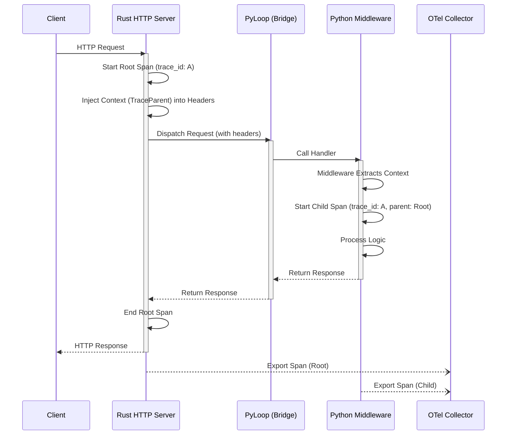

# Design: PyLoop GCP Observability

## 1. Architecture: The Gateway Pattern

We use the "Rust as Gateway" pattern. Since Rust terminates the HTTP connection, it owns the **Root Span**.



## 2. Rust Implementation Details

### Dependencies
```toml
[dependencies]
opentelemetry = "0.21"
opentelemetry_sdk = { version = "0.21", features = ["rt-tokio"] }
opentelemetry-otlp = "0.14"
tracing = "0.1"
tracing-opentelemetry = "0.22"
tracing-subscriber = { version = "0.3", features = ["env-filter", "json"] }
```

### Context Injection
We must manually inject the context because `data-bridge-api` converts `HyperRequest` to `SerializableRequest` manually.
We will use `opentelemetry::global::get_text_map_propagator` to inject into a `HeaderMap`, then copy those headers to `SerializableRequest`.

## 3. Python Implementation Details

### Dependencies
```toml
[project.dependencies]
opentelemetry-api = "^1.20.0"
opentelemetry-sdk = "^1.20.0"
opentelemetry-exporter-otlp = "^1.20.0"
```

### Middleware Logic
The `OpenTelemetryMiddleware` must use `TraceContextTextMapPropagator` from `opentelemetry.trace.propagation` to extract the context from the `request["headers"]` dict.

## 4. Infrastructure (GKE)

### OTel Collector Configuration (Sidecar)
```yaml
receivers:
  otlp:
    protocols:
      grpc:
      http:

exporters:
  googlecloud:
    # Google Cloud Operations
    project: "my-project-id"

processors:
  batch:
  resourcedetection:
    detectors: [gcp]

service:
  pipelines:
    traces:
      receivers: [otlp]
      processors: [resourcedetection, batch]
      exporters: [googlecloud]
```
