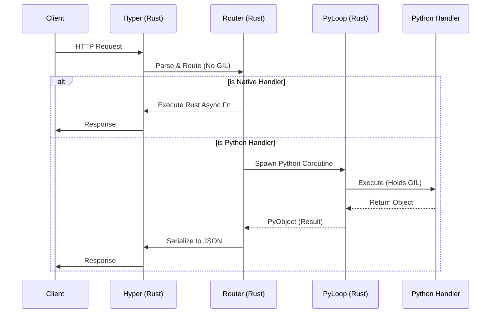

# Design: PyLoop + HTTP Server Integration

## Context
The goal is to eliminate the overhead of ASGI and standard Python web servers by letting Rust handle the "heavy lifting" of HTTP. Python should only be invoked when business logic requires it.

## Architecture: The Hybrid Dispatcher

### 1. Unified Runtime Model
Instead of Python starting a loop (uvloop) and Rust starting a runtime (Tokio), we invert control:
1.  Python script starts.
2.  User calls `app.run()`.
3.  Rust initializes **Global Tokio Runtime** (singleton).
4.  `PyLoop` installs itself as the Python Event Loop on this runtime.
5.  Hyper Server spawns on the *same* runtime.

### 2. Request Lifecycle


### 3. Declarative DSL (Type-Driven CRUD)
To further reduce Python overhead, we introduce "Type-Driven Routes".

**User Code:**
```python
class User(Model):
    id: UUID
    name: str

@app.crud(User)
class UserRoutes:
    pass
```

**Rust Implementation:**
1.  `app.crud` decorator captures the `User` class.
2.  Calls Rust `register_crud(schema: PyObject)`.
3.  Rust inspects `schema` fields (using `pyo3`).
4.  Rust registers 5 optimized handlers:
    - `GET /user` -> `handlers::list::<User>`
    - `POST /user` -> `handlers::create::<User>`
    - etc.
5.  These handlers use the **MongoDB ORM** directly in Rust.
    - **Zero Python execution** for standard CRUD operations.

## Data Exchange
- **Request**: Hyper `Request` -> `SerializableRequest` (Rust struct) -> (only if Python handler) -> `PyRequest` (Python object).
- **Response**: Python returns `dict` or `PydanticModel` -> Rust converts to `serde_json::Value` -> Hyper `Response`.

## Performance Strategy
1.  **Lazy Conversion**: Don't convert HTTP body to Python `bytes`/`str` until the handler actually requests it.
2.  **Gil-Free Routing**: Path matching, query parsing, and header validation happen without the GIL.
3.  **Thread Safety**: Python handlers are scheduled on the `LocalSet` of the thread that holds the GIL, or via `PyLoop`'s task queue.

## Open Questions
- **Middleware**: How to share middleware between Rust and Python? 
    - *Decision*: Middleware is primarily Rust-based for performance (logging, auth, compression). Python middleware is supported but discouraged for high-throughput paths.
